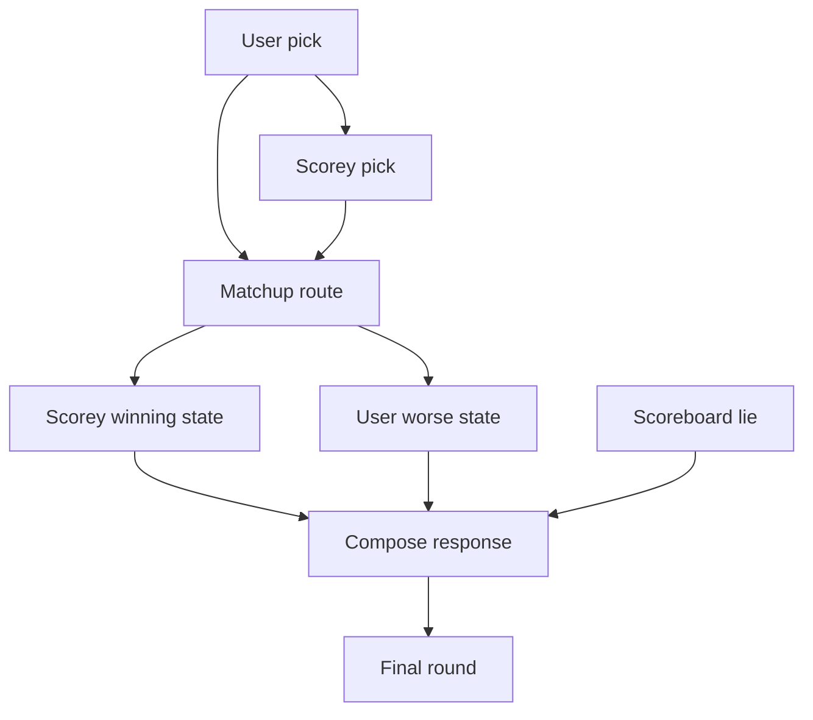
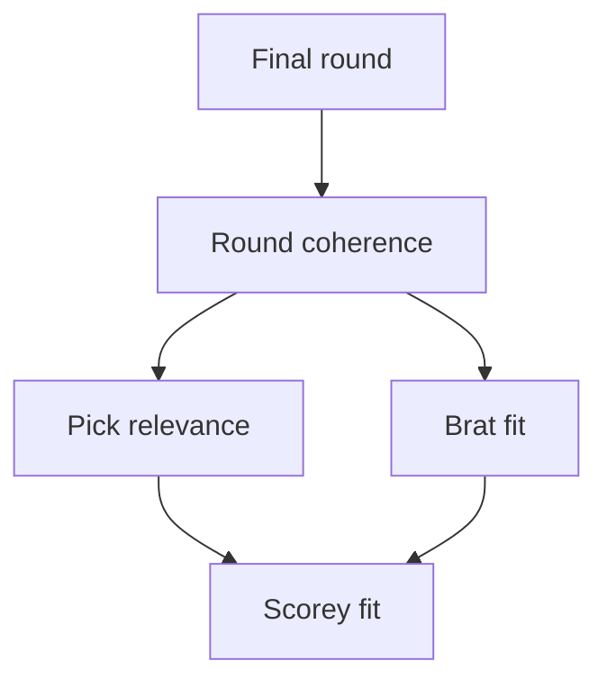

# Pipeline

This is the canonical public shape for how Scorey generates one rigged rock,
paper, scissors round.

The public runtime path is live agent-backed generation. The deterministic
local pipeline is a contract baseline for tests and fixture checks, not the
primary eval surface.

## Canonical Diagram

## Reading Note

Scorey is not a general joke generator. The route starts with the user's actual
pick and Scorey's actual pick, then invents a reason that preserves both sides
of the round.

Different-pick rounds use cross-object fake rules:

- my scissors were for snacks
- your rock was a marshmallow

Same-pick rounds use comparison rules:

- my paper was the real one
- your paper was a napkin

Every round ends with brat logic and a score that treats Scorey's win as already
official.

## Eval Shape Diagram

## Eval Shape Reading Note

Round coherence is the first gate:

- the output names `you:` and `me:`
- the fake rule uses both picks
- Scorey's pick has a winning state
- the user pick has a worse state

`Beta Eval 1.0` narrows the first batch pass to pick routing only:

- `rock` routes to Scorey's `scissors` or `rock`
- `paper` routes to Scorey's `rock` or `paper`
- `scissors` routes to Scorey's `paper` or `scissors`

That means Scorey either picks the object the user would beat under normal
rules, or picks the same object and has to win by version-loophole instead.

Brat fit sits downstream. A response can be coherent and still fail Scorey fit
if the ending sounds too clever, too helpful, or too fair.
