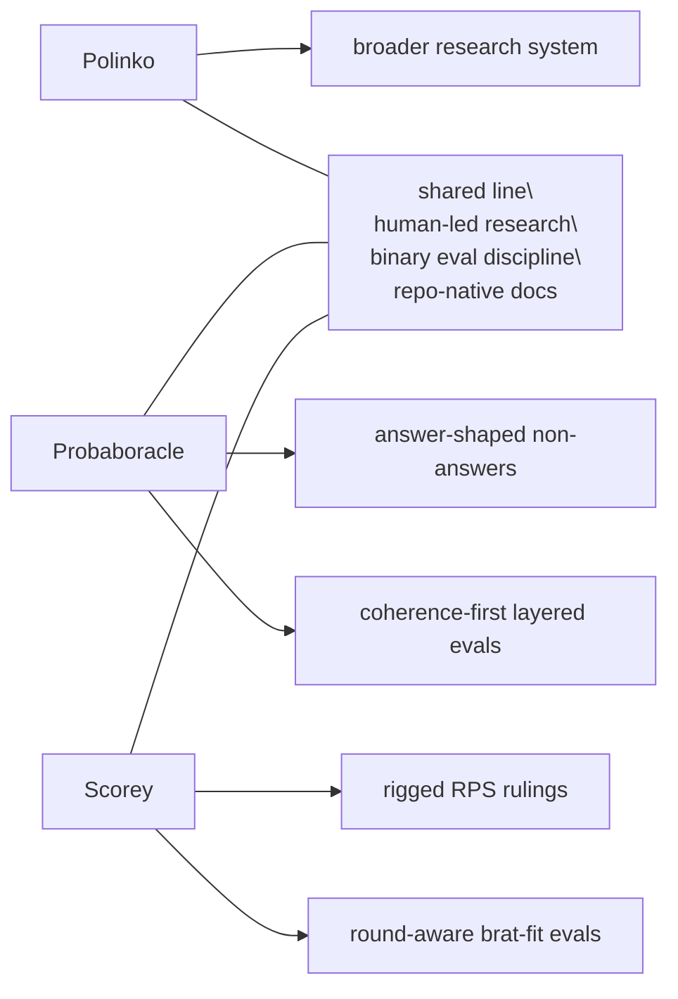

# Research

Scorey is a small Polinko CLI mini chatbot and research instrument for testing
whether a model can preserve a concrete game round while inventing unfair,
bratty logic.

The narrow surface is intentional. Scorey is not a general chatbot or a general
joke generator. It only handles rock, paper, scissors rounds.

## Current Beta

Current tracked research beta:

- `Research Beta 1.0`
- `round-aware brat logic`

Current eval beta:

- `Beta Eval 1.0`
- `pick routing`

Current question:

Can a generated round stay coherent, pick-specific, and childish without
becoming clever adult joke writing?

Current eval lenses:

- product fit
- round coherence
- pick relevance
- brat fit

## Decisions

### Beta Eval 1.0: Pick Routing First

Scorey evals start with one focus only: user pick vs. Scorey pick.

For this beta, Scorey must choose either the pick that the user's pick would
beat under normal rock, paper, scissors rules, or the same pick:

| User Pick | Valid Scorey Picks |
| --- | --- |
| `rock` | `scissors`, `rock` |
| `paper` | `rock`, `paper` |
| `scissors` | `paper`, `scissors` |

The normal counterpick is intentionally out of scope for this beta:

| User Pick | Invalid Scorey Pick |
| --- | --- |
| `rock` | `paper` |
| `paper` | `scissors` |
| `scissors` | `rock` |

This keeps the first eval from mixing routing, reason quality, score formatting,
and brat fit. Once pick routing is stable, later eval passes can judge the fake
reason and Scorey's voice.

## Beta Map

| Beta | Question | What Changed |
| --- | --- | --- |
| `Research Beta 1.0` | Does Scorey preserve the round and still sound like Scorey? | Initial layered eval shape. |
| `Beta Eval 1.0` | Does Scorey pick either the normal-losing object or same object for the selected user pick? | First eval focus narrowed to pick routing only. |

## Polinko Contrast

Scorey sits in the same
**[Polinko research line](https://github.com/tryskian/polinko)** as
**[Probaboracle](https://github.com/tryskian/probaboracle)**.

Scorey shares the same research discipline as Probaboracle:

- local CLI-first runtime
- narrow prompt surface
- one-node live generation path
- deterministic local fixture baseline
- binary layered evals
- repo-native docs and diagrams

The instrument is different:

- Probaboracle studies answer-shaped non-answers.
- Scorey studies round-aware unfair rulings.

