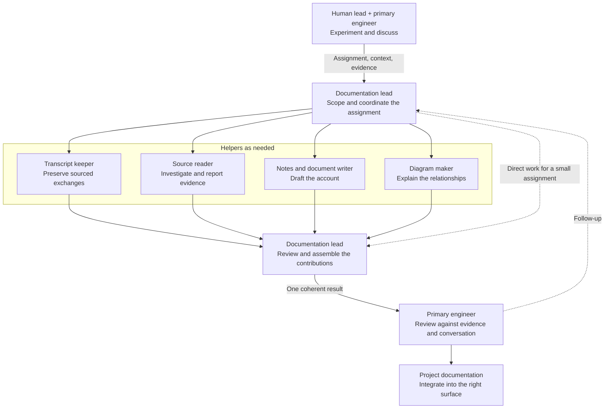

# Experiment and Documentation Collaboration

This is the workflow agreed in
[D-037](../governance/DECISIONS.md#d-037-delegate-documentation-to-a-continuing-project-task):
the human lead and primary engineer work together on experiments, while a
continuing documentation task coordinates supporting work in the same local
checkout.

## Delegation and Return

## Reading the Diagram

| Role | Owns |
| --- | --- |
| Human lead | Questions, scope, acceptance criteria, current research verdicts, meaning-level judgement, and go/no-go decisions |
| Primary engineer | Experiment execution, assignments to the documentation lead, final review and integration, and shared-checkout Git operations |
| Documentation lead | Breaking down the assigned work, choosing useful helpers, coordinating their files, reviewing their contributions, and returning a coherent result |
| Helpers | Bounded transcript capture, source reading, writing, or diagram work with the context and sources supplied by the documentation lead |

The helper roles are examples. The documentation lead can complete a small
assignment directly or assemble a team when the work benefits from it. The
lead's review brings the contributions together before the primary engineer
reviews the result with the experiment and conversation in view.

Transcript capture can progress alongside the experiments. The transcript
keeper preserves supplied exchanges or directly inspected source messages,
including speakers, order, and the source task and message range. Exact source
wording stays distinct from summaries and interpretation; gaps are marked and
later corrections remain visible. Capture dates stay separate from discourse
dates. The primary engineer supplies or identifies the source at handoff points
so the documentation team can preserve it while the experiment discussion
continues. Captures stay in the private `docs/peanut/transcripts/` lane.

All supporting work stays within the agreed active kernel. The primary engineer
coordinates file ownership with the documentation lead, which divides its
assigned files among helpers. Observations, hypotheses, and human decisions
retain distinct attribution. Meaning-level questions return to the human lead
and primary engineer's conversation.

The [charter](../governance/CHARTER.md#documentation-delegation) owns the durable
collaboration rules. The [session handoff](../governance/SESSION_HANDOFF.md)
records whether the companion task has been created and its identifier. Private
working notes stay in `docs/peanut/`; canonical eval evidence stays in `.local/`.
