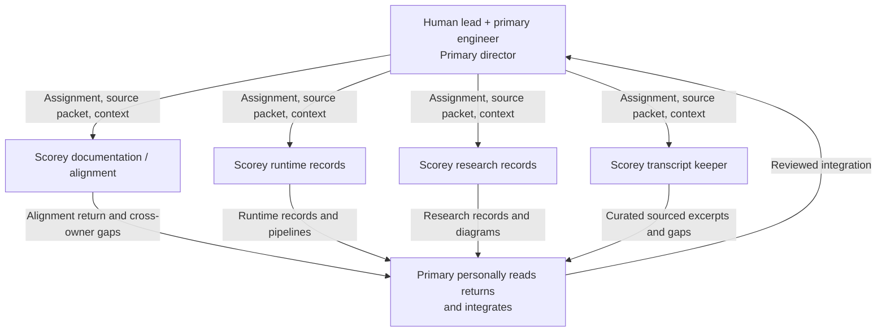

# Experiment and Documentation Collaboration

This is the workflow agreed in
[the charter](../governance/CHARTER.md#documentation-delegation):
the human lead and primary engineer work together on experiments, while four
focused continuing tasks return bounded work through the same local checkout.

## Delegation and Return

## Reading the Diagram

| Role | Owns |
| --- | --- |
| Human lead | Questions, scope, acceptance criteria, current research verdicts, meaning-level judgement, and go/no-go decisions |
| Primary engineer / SCO-2 director | Experiment execution, source packets and assignments to focused tasks, final review and integration, and shared-checkout Git operations |
| Alignment task | Cross-document alignment, public framing, charter, handoff, collaboration diagram, and cross-owner gap reports |
| Runtime records task | `DECISIONS.md`, `ARCHITECTURE.md`, `RUNBOOK.md`, and `START_END_REFERENCE.md` |
| Research records task | Assigned tracked research and current private research summaries |
| Transcript keeper | Curated excerpts under `docs/peanut/transcripts/`, with exact speech/source limits and separated interpretation |
| Supporting subagents | Bounded internal work inherited from the delegating task's file ownership |

The focused tasks are continuing return paths, not automatic workers. The
primary engineer dispatches each source packet, each task receives only the
context needed for its assignment, and later parent messages do not
automatically reach it. The primary personally reads each returned edit or
report before integration.

Each focused task may use bounded internal subagents within its inherited file
boundary; those helpers return to their delegating task and do not widen ownership.

Research records include research diagrams; runtime records include execution
pipelines. Owners create or update these with the relevant records, grounding
them in verified method and implementation and labelling proposed flows.
Alignment checks consistency and coordinates changes across file owners.
Captures preserve source diagrams and provenance separately from new
explanatory drawings.

For the saved coherent-absurdity experiment, research records preserve one
complete composed round at a time with its response, picks, conditions,
timings, token use, verdict, reason, source, and field-or-phrase location.
Assistant observations are attributed separately from human verdicts and may
exist without a verdict; exact human wording remains preserved. The implemented
dataset, case, and event tables plus the notebook `.notes.json` sidecar are
additive to existing review tooling and historical gate tables; import preserves
attributed review events but does not itself imply promotion.

Generation and method adaptation are paused under D-045. Readers follow the
existing protocol, report source gaps, and return unresolved meaning to the
human lead; they do not invent a replacement method.

Transcript capture can begin when a supplied or directly inspected exchange
contains a meaningful discovery, correction, or rationale. The transcript
keeper preserves speakers, order, source task and message range, exact speech
limits, and separated interpretation. Gaps are marked and later corrections
remain visible; capture dates stay separate from discourse dates. Captures stay
in the private `docs/peanut/transcripts/` lane and follow the format routed by
the [local transcript README](../peanut/transcripts/README.md).

All supporting work stays within the agreed active kernel. The primary engineer
coordinates file ownership across the focused tasks. Observations, hypotheses,
and human decisions retain distinct attribution. Meaning-level questions return
to the human lead and primary engineer's conversation.

The [charter](../governance/CHARTER.md#documentation-delegation) owns the durable
collaboration rules. The [session handoff](../governance/SESSION_HANDOFF.md)
records the continuing task registry, sole ownership, and return paths. Private
working notes stay in `docs/peanut/`; canonical eval evidence stays in `.local/`.
