# Golden Smoke

This diagram records the implemented coherent-absurdity smoke path. It is an
execution record, not a new beta gate or a replacement for the canonical
[pipeline shape](PIPELINE.md).

## Execution Pipeline

This records retained experimental tooling. New preparation and generation
are paused under D-045; the existing fixture lacks high-signal user/assistant
reference pairs. It is not the completed golden-prompt method.

```mermaid
flowchart LR
  A["make smoke-prepare"]
  B["Validate six golden cases<br/>three reverse + three same-pick<br/>starting score 1"]
  C["Freeze manifest and source packet<br/>sources, patch, settings, prompts,<br/>schema, endpoint, retrieval, limits"]
  D["make smoke-run SMOKE_RUN=..."]
  E["Integrity checks<br/>manifest, sources, patch, packages,<br/>and run-not-started state"]
  F["At most six fresh independent calls<br/>one case per call<br/>zero retries, 60-second limit"]
  G["Capture request and raw response<br/>IDs, usage, failures"]
  H["Write attempt receipt<br/>fields, composed round,<br/>route and mechanical checks"]
  I["Write summary and review<br/>mechanical pass/fail<br/>unattempted cases if stopped"]
  J["Import saved run + criteria<br/>review_datasets + review_cases<br/>source bytes and hashes"]
  K["Read-only review notebook<br/>review_datasets + review_cases + review_events<br/>separate .notes.json"]
  L["Explicit notes sync<br/>append-only review_events<br/>observation or judgment"]
  M["Canonical eval_* rows and gates<br/>unchanged"]
  N["Original app scoring unchanged<br/>runtime score + me: [score],<br/>you: [scoreboard_claim]"]

  A --> B --> C --> D --> E --> F
  F --> G --> H --> I --> J --> K --> L
  F -.->|configuration or capacity error| I
  M -.->|not written or advanced| H
  N -.->|app contract preserved| H
```

Solid arrows are implemented execution. Dashed arrows mark a boundary,
condition, or separate review surface rather than an additional runtime step.

## Shared Contract, Different Transport

The app and smoke runner share [`build_live_agent`](../../src/scorey/agent.py),
the restored `restored-321d970` instructions, model settings, and structured
`RoundFields` output contract. Their request plumbing is intentionally
different:

| Surface | Implemented request path |
| --- | --- |
| Live app | `generate_live_round_fields` uses `Runner.run_sync` with the ordinary SDK client, transport, and retry defaults. |
| Golden smoke | `Runner.run` uses an injected `AsyncOpenAI` client through `OpenAIProvider`, Responses API, non-streaming transport, tracing disabled, `max_retries=0`, and a 60-second timeout. |

The saved September 21 run used `coherent-absurdity-1`; its original source
snapshot remains unchanged.

The smoke runner also captures the provider request and raw response before it
writes the immutable attempt receipt. A failed or interrupted attempt still
gets a receipt; a request or response file exists only when that stage was
reached.

## Frozen Inputs and Boundaries

- [`golden_cases.json`](../../src/scorey/data/golden_cases.json) defines the
  six fixed inputs and their score-1 starting condition.
- [`smoke.py`](../../src/scorey/smoke.py) validates the fixture, freezes the
  source revision and patch, records settings and retrieval context, checks
  package/source integrity, and refuses a previously started run.
- Preparation makes no model request. Execution uses one fresh request per
  case, with no conversation or previous response carried between cases.
- The runtime composes the returned fields and applies the route check. Smoke
  writes only its isolated run folder; it does not write canonical eval rows,
  mutate eval or memory databases, advance historical gates, or establish a
  numerical beta.
- Mechanical results are recorded in receipts, `summary.json`, and
  `review.md`. The explicit review import stores source-bound copies of the run
  and criteria in additive `review_*` tables. The notebook reads the imported
  dataset and event tables and saves a separate `.notes.json` sidecar outside
  the immutable smoke folder; `import-notes` validates and
  appends attributed observations or judgments to `review_events`. Semantic
  quality remains pending until an attributed judgment is recorded, and no
  mechanical completion is treated as a quality verdict.

The governing decision is
[D-041](../governance/DECISIONS.md#d-041-explore-coherent-absurdity-through-frozen-golden-cases)
and [D-043](../governance/DECISIONS.md#d-043-preserve-scoreys-review-meaning-while-adding-attributed-notes);
the operator procedure is the [Golden Prompt Smoke runbook section](../runtime/RUNBOOK.md#golden-prompt-smoke).
