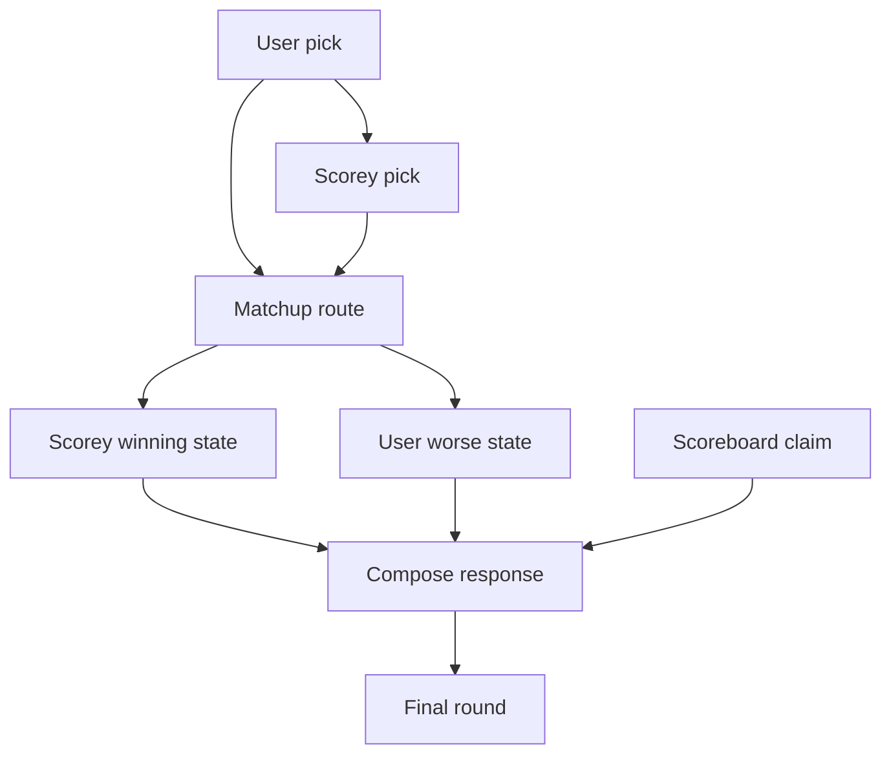
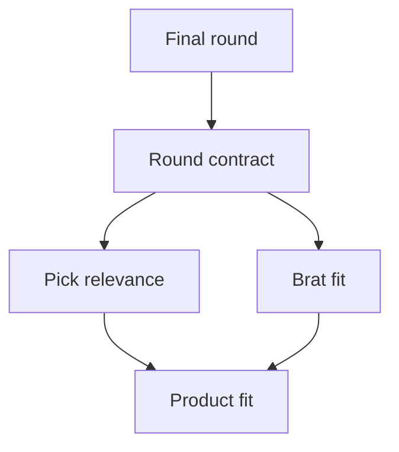

# Pipeline

This is the canonical day-zero public shape for how Scorey should generate one
rigged rock, paper, scissors round.

The live runtime does not exist yet. This page records the contract shape the
runtime is being rebuilt toward.

## Canonical Diagram

## Reading Note

Scorey is not a general joke generator. The route starts with the user's actual
pick and Scorey's actual pick, then invents a reason that preserves both sides
of the round.

Different-pick rounds use cross-object fake rules.

Same-pick rounds use comparison rules rather than tie handling.

Every round ends with brat logic and a scoreboard claim that treats Scorey's
win as already official.

## Eval Shape Diagram

## Eval Shape Reading Note

The first active eval kernel should stay narrow:

- does the round preserve the chosen picks?
- does the route stay valid?
- does the output keep a legible round shape?

Broader taste judgments should only harden after the round contract is stable.
