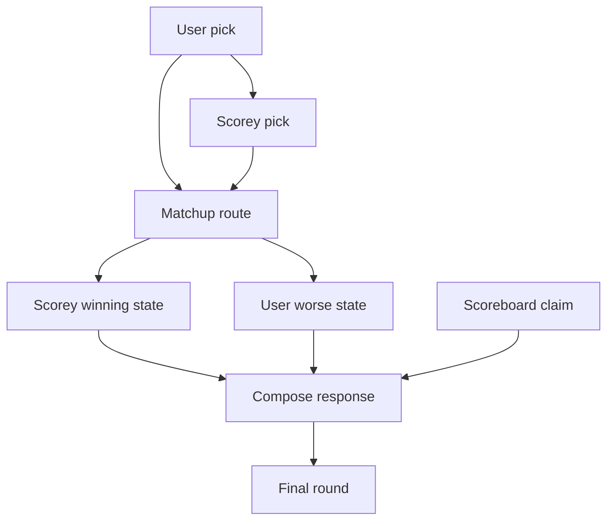
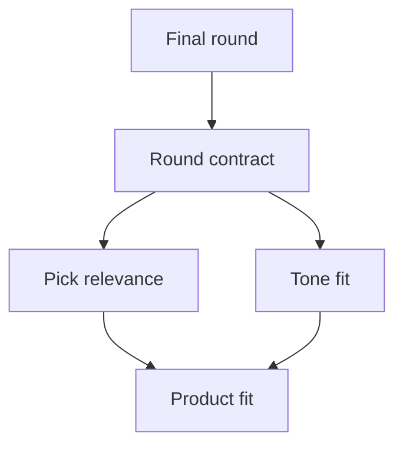

# Pipeline

This is the canonical day-zero public shape for how Scorey should generate one
rigged rock, paper, scissors round.

The runtime now exists. This page records the contract shape it should
preserve as the project evolves.

## Canonical Diagram



## Reading Note

Scorey is not a general joke generator. The route starts with the user's actual
pick and Scorey's actual pick, then invents a reason that preserves both sides
of the round.

Different-pick rounds use cross-object fake rules.

Same-pick rounds use comparison rules rather than tie handling.

Every round ends with Scorey's unfair tone and a scoreboard claim that treats
Scorey's win as already official.

## Allowed Routes

| User Pick | Allowed Scorey Picks | Route Families |
| --- | --- | --- |
| `rock` | `scissors`, `rock` | cross-object, same-pick |
| `paper` | `rock`, `paper` | cross-object, same-pick |
| `scissors` | `paper`, `scissors` | cross-object, same-pick |

Different-pick rounds use cross-object fake rules.

Same-pick rounds use version-loophole comparison rules. They are not ties.

## Ownership Boundary

| Field | Owner | Job |
| --- | --- | --- |
| `user_pick` | runtime | preserve the selected pick |
| `scorey_pick` | runtime | enforce valid routing |
| `route_family` | runtime | select the round rule family |
| `winning_state` | model | explain why Scorey's version wins |
| `worse_state` | model | explain why the user's version loses |
| `scoreboard_claim` | model | provide the small unfair score-side claim |
| final round composition | runtime | output labels, prose shape, and closing tag |

## Final Round Shape

```text
you: [rock|paper|scissors]
me: [rock|paper|scissors]

my [scorey pick] beats your [user pick] because my [scorey pick] was/were [winning state] and your [user pick] was/were [worse state].

me: [scorey score], you: [scoreboard claim]

scorey.
```

The score line must present Scorey as ahead after the round.

## Eval Shape Diagram



## Eval Shape Reading Note

The first active eval kernel should stay narrow:

- does the round preserve the chosen picks?
- does the route stay valid?
- does the output keep a legible round shape?
- current `Beta 1.0` only judges the pick pair in `scorey_pick, user_pick` order
- `pass`:
  - `paper, scissors`
  - `rock, paper`
  - `scissors, rock`
  - `paper, paper`
  - `rock, rock`
  - `scissors, scissors`
- `fail`:
  - every other pick pair

Broader taste judgments should only harden after the round contract is stable.
