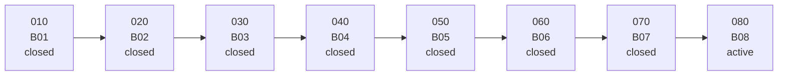
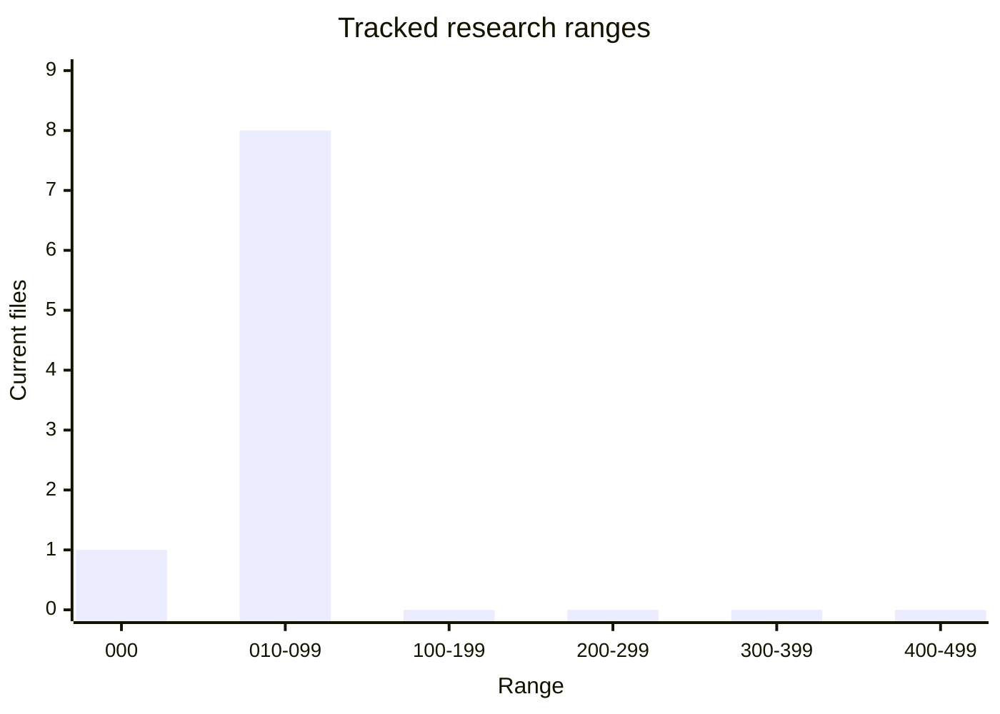

# Research Legend

| Field | Value |
| --- | --- |
| Code | `000_LEGEND` |
| Category | `legend` |
| Status | `active` |
| Last evidence | `2026-06-06` |
| Owns | file map, code ranges, and shared status language for tracked research docs. |

## Boundary Map

| Code | File | Meaning | Category | Status |
| --- | --- | --- | --- | --- |
| `B01` | `010_B-PICK_ROUTING.md` | pick-routing boundary | `boundary` | `closed` |
| `B02` | `020_B-OBJECT_LANES.md` | focused object-lane boundary | `boundary` | `closed` |
| `B03` | `030_B-TONE_FIRST.md` | anchored tone-first boundary | `boundary` | `closed` |
| `B04` | `040_B-ABSTRACT_TONE_MEASUREMENT.md` | de-anchored tone boundary | `boundary` | `closed` |
| `B05` | `050_B-FAIL_PRESSURE_PULSE.md` | fail-pressure pulse boundary | `boundary` | `closed` |
| `B06` | `060_B-SCOREBOARD_JUDGEMENT.md` | scoreboard judgement boundary | `boundary` | `closed` |
| `B07` | `070_B-BROADER_PROSE_JUDGEMENT.md` | broader prose judgement boundary | `boundary` | `closed` |
| `B08` | `080_B-MENACE_JUDGEMENT.md` | menace-judgement boundary | `boundary` | `active` |

Boundary ladder:

## Ordering

| Range | Role |
| ---: | --- |
| `000` | index and legend |
| `010-099` | closed or active beta boundaries |
| `100-199` | route and tone lane docs |
| `200-299` | bounded lens and family lane docs |
| `300-399` | operator gate and validation lane docs |
| `400-499` | staged pre-beta boundaries, hypotheses, and backlog |

Range chart:

## Chart Key

Pair abbreviations used in charts:

| Abbreviation | Meaning |
| --- | --- |
| `PP` | `paper/paper` |
| `PS` | `paper/scissors` |
| `RP` | `rock/paper` |
| `RR` | `rock/rock` |
| `SR` | `scissors/rock` |
| `SS` | `scissors/scissors` |

## Status Meanings

| Status | Meaning |
| --- | --- |
| `staged` | next boundary, not live evidence yet |
| `active` | current live boundary or lane |
| `closed` | finished evidence surface held and moved into baseline |
| `paused` | lane intentionally stopped without promotion |
| `snapshot` | bounded read captured for reference |
| `representative` | case stands in for a wider seam cleanly |
| `running` | validation is in progress |
| `failed` | validation did not hold |
| `archived` | preserved but no longer active |

## Category Meanings

| Category | Owns |
| --- | --- |
| `legend` | file map, code ranges, and shared status language |
| `boundary` | beta or pre-beta method boundary |
| `lane` | active or closed evidence lane and read |
| `case` | one representative output, row, pulse, or bounded slice |
| `validation` | run, soak, gate, or closeout proof |
| `hypothesis` | staged claim before promotion or retirement |
| `backlog` | candidate seams, source pools, and parked follow-up lanes |
