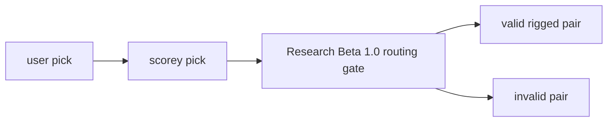

# Research Beta 1.0: Pick Routing First

| Field | Value |
| --- | --- |
| Code | `010_B-PICK_ROUTING` |
| Category | `boundary` |
| Status | `closed` |
| Last evidence | `2026-05-15` |
| Owns | the routing-only beta boundary for valid rigged pick pairs. |

## What This Beta Asks

Does Scorey choose a valid rigged route for the selected user pick?

## Status

Closed.

The first gate held once the eval lane stopped treating the three local
fixtures as if they were the whole pass table.

## Eval Shape

`Research Beta 1.0` judges the pick pair only.

It reads every row in `scorey_pick, user_pick` order.

| Pair | Verdict |
| --- | --- |
| `paper, scissors` | `pass` |
| `rock, paper` | `pass` |
| `scissors, rock` | `pass` |
| `paper, paper` | `pass` |
| `rock, rock` | `pass` |
| `scissors, scissors` | `pass` |
| every other `scorey_pick, user_pick` pair | `fail` |

What stays out of scope:

- round prose
- tone
- scoreboard claim

## Diagram

Coverage chart:

```mermaid
xychart-beta
  title "Beta 1.0 coverage reads"
  x-axis "Coverage read" ["long soak", "six-pair coverage"]
  y-axis "Rows" 0 --> 4000
  bar "Pass" [3578, 3582]
  bar "Fail" [0, 0]
```

## What It Showed

The first long local soak proved the storage lane and gate, but only hit a narrow deterministic subset:

| Read | Rows | Pass | Fail | Shape |
| --- | ---: | ---: | ---: | --- |
| first long local soak | `3578` | `3578` | `0` | only three valid pass pairs appeared |
| six-pair coverage sampler | `3582` | `3582` | `0` | `597` rows for each valid pass pair |

So the result of `Research Beta 1.0` is not just that Scorey can pass. It is that the full pass table now has a stable deterministic coverage lane.

## Why It Matters

Every later lens depends on a closed routing floor.

Without this boundary, later tone, prose, pulse, scoreboard, and menace reads
would all be mixing structural route failure with the thing they were supposed
to judge next.

## What It Still Cannot Show

- live model behaviour
- round prose quality
- tone stability
- scoreboard quality

## What Changed Next

Once the full pass table was stable, the next question stopped being “is the route valid at all?” and became “can one object stay stable when it is isolated across both roles?”

That shift is `Research Beta 2.0`.
