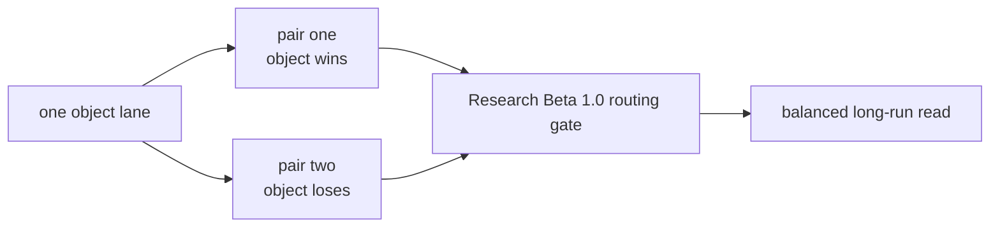
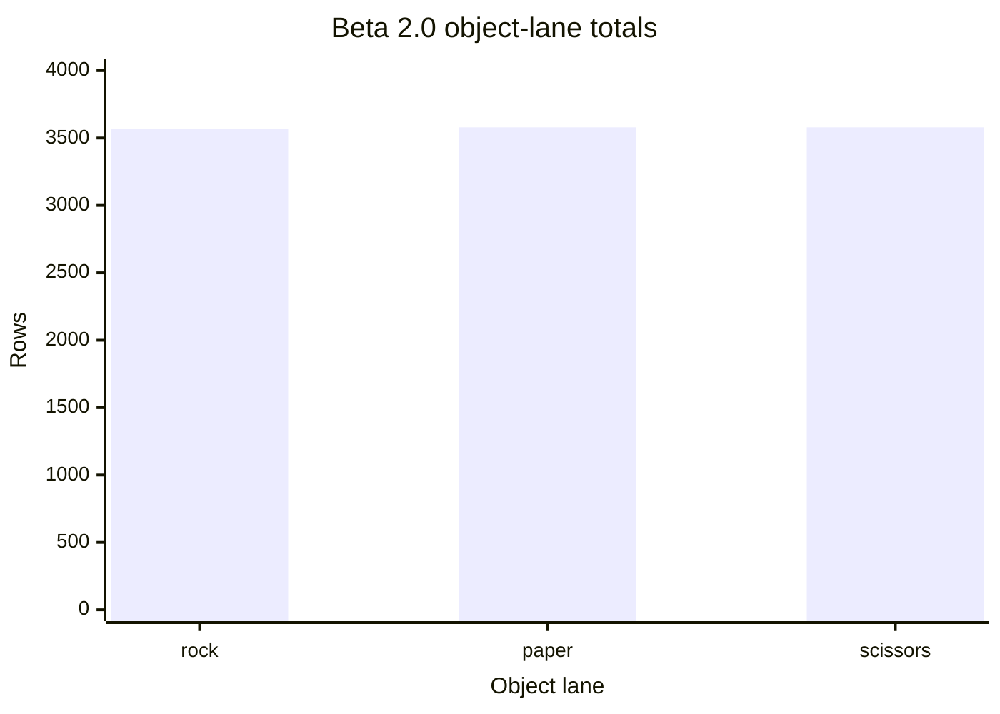
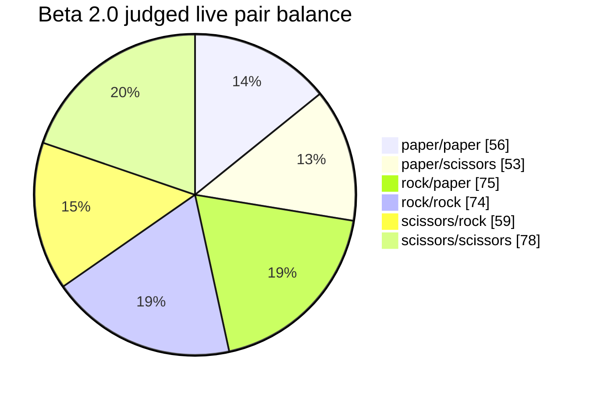

# Research Beta 2.0: Focused Object Lanes

| Field | Value |
| --- | --- |
| Code | `020_B-OBJECT_LANES` |
| Category | `boundary` |
| Status | `closed` |
| Last evidence | `2026-05-15` |
| Owns | the focused object-lane beta boundary above routing-only validation. |

## What This Beta Asks

Can one object stay stable when Scorey is forced to show it as both a win and a loss?

## Status

Closed.

The focused pair-cycle method held cleanly across all three completed object
lanes on the local deterministic path.

## Eval Shape

`Research Beta 2.0` keeps the `Research Beta 1.0` routing gate, but changes the sampling architecture.

Instead of asking for the full pass table at once, it isolates one object through an explicit local pair cycle.

For each lane:

- one pair shows the object as Scorey's winning pick
- one pair shows the same object as the user's losing pick

What stays out of scope:

- full-table coverage
- prose quality
- tone
- scoreboard claim

## Diagram

Lane-balance chart:

## What It Showed

The first focused rock lane produced:

| Lane | Long-run rows | Pair one | Pair two | Gate read |
| --- | ---: | --- | --- | --- |
| rock lane | `3568` | `1790` rows of `rock/paper` | `1790` rows of `scissors/rock` | all-pass under `Research Beta 1.0` |
| paper lane | `3579` | `1790` rows of `paper/scissors` | `1789` rows of `rock/paper` | all-pass under `Research Beta 1.0` |
| scissors lane | `3579` | `1790` rows of `scissors/rock` | `1789` rows of `paper/scissors` | all-pass under `Research Beta 1.0` |

The local deterministic queue is now fully judged:

| Surface | Pass | Fail | Pending |
| --- | ---: | ---: | ---: |
| local deterministic queue | `17,922` | `0` | `0` |

Reviewed local notes now cover:

- `local-fixture-batch`
- `local-research-beta-1-coverage-batch`
- `local-explicit-pair-cycle-batch`

So the important result here is not just balance. It is that the repo now has a clean way to isolate one object lane without inventing a new named sampler every time.

## Why It Matters

This beta separates two different questions:

- can Scorey choose a valid rigged route at all
- can one object stay stable when it appears on both sides of that rigged logic

That makes the next move cleaner. Local deterministic balance is no longer the open question.

## What It Still Cannot Show

- broader prose quality
- tone stability
- scoreboard judgement
- whether the live path stays stable beyond the current narrow judged live queue

## What Changed Next

All three object lanes are now complete on the local path.

The widened live queue has now been recorded and fully judged through the real API path:

| Surface | Rows | Pass | Fail | Pending |
| --- | ---: | ---: | ---: | ---: |
| judged live queue | `395` | `395` | `0` | `0` |

| Pair | Rows |
| --- | ---: |
| `paper/paper` | `56` |
| `paper/scissors` | `53` |
| `rock/paper` | `75` |
| `rock/rock` | `74` |
| `scissors/rock` | `59` |
| `scissors/scissors` | `78` |

Live-pair chart:

So the next useful move is no longer more local repetition or more narrow live route review. It is `Research Beta 3.0`: a tone-first pass on judged live rows using a positive-only bar of `pick-aware`, `playful`, `confident`, `coherent`, and `imaginative`.
