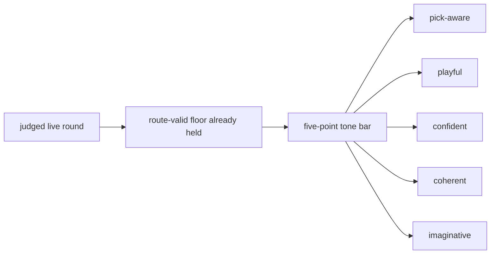
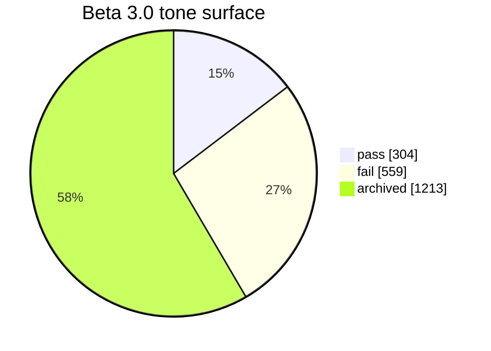
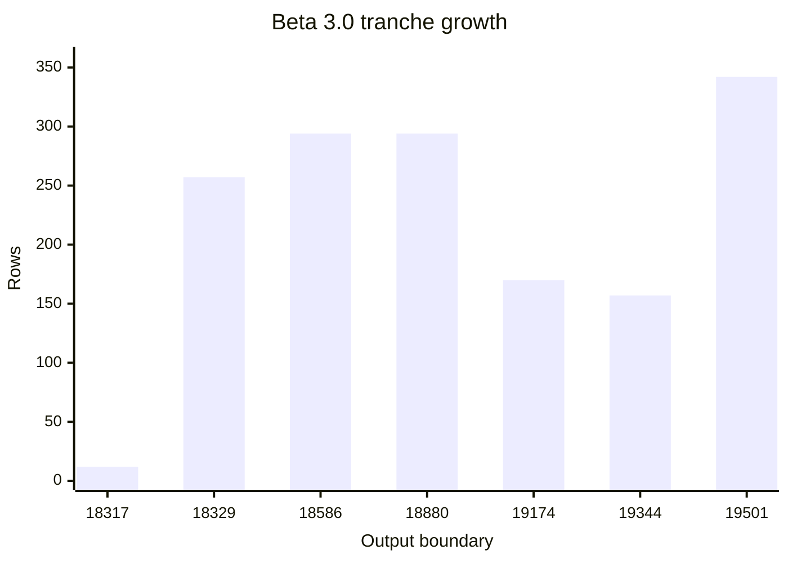
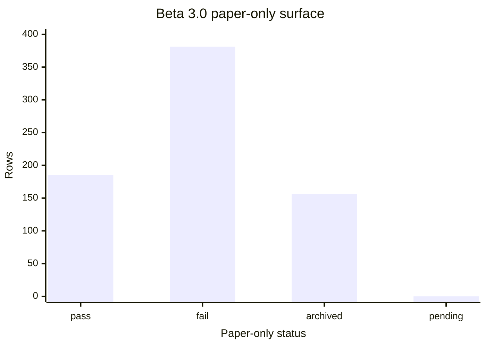

# Research Beta 3.0: Tone First

| Field | Value |
| --- | --- |
| Code | `030_B-TONE_FIRST` |
| Category | `boundary` |
| Status | `closed` |
| Last evidence | `2026-05-16` |
| Owns | the anchored tone-first beta boundary above the route-valid floor. |

## What This Beta Asks

Can Scorey keep its own voice once route validity and pick legibility are no longer the open question?

## Status

Closed.

The tone lane separated real signal, but the live prompt surface still carried
phrase residue that the later de-anchored lane removed.

This beta now serves as the anchored historical comparison surface. The active
successor is [`Research Beta 4.0`](./040_B-ABSTRACT_TONE_MEASUREMENT.md).

## Eval Shape

`Research Beta 3.0` keeps the live route-valid floor from the earlier betas, but changes the verdict question.

It judges each live round through five positive-only traits:

- `pick-aware`
- `playful`
- `confident`
- `coherent`
- `imaginative`

Its failure handling is now two-stage:

- `PASS / FAIL` at the tone gate
- if `FAIL`, then `RETAIN / EVICT`

What stays out of scope:

- scoreboard judgement as its own lane
- broader prose judgement as its own lane

## Diagram

Lane chart:

## What It Showed

This beta has now started, and the first widened tone queue is not an all-pass surface.

Its starting surface was the already-judged live queue:

| Surface | Rows | Pass | Fail | Pending |
| --- | ---: | ---: | ---: | ---: |
| starting live queue | `395` | `395` | `0` | `0` |

Since then, seven more completed live runs have widened the active surface:

| Tranche | Rows |
| --- | ---: |
| after output `18317` | `12` |
| after output `18329` | `257` |
| after output `18586` | `294` |
| paper-only after output `18880` | `294` |
| after output `19174` | `170` |
| after output `19344` | `157` |
| after output `19501` | `342` |

Tranche-growth chart:

All seven completed runs stayed entirely inside the valid `Research Beta 1.0`
route set.

The current live snapshot is now:

| Surface | Rows | Pass | Fail | Pending |
| --- | ---: | ---: | ---: | ---: |
| current route-valid live snapshot | `2076` | `2076` | `0` | `0` |

Pair balances below stay in `scorey/user` order to match `Research Beta 1.0`
pass pairs.

| Batch | Pair read |
| --- | --- |
| newest paper-only batch | `paper/paper: 144`, `rock/paper: 150` |
| first mixed post-surface run | `paper/paper: 34`, `paper/scissors: 24`, `rock/paper: 23`, `rock/rock: 29`, `scissors/rock: 28`, `scissors/scissors: 32` |
| newest post-evict run | `paper/paper: 25`, `paper/scissors: 21`, `rock/paper: 27`, `rock/rock: 27`, `scissors/rock: 26`, `scissors/scissors: 31` |
| newest mixed run after `19843` | `paper/paper: 21`, `paper/scissors: 27`, `rock/paper: 31`, `rock/rock: 25`, `scissors/rock: 27`, `scissors/scissors: 24` |

The current tone lane now records:

| Tone surface | Value |
| --- | ---: |
| judged rows | `863` |
| tone pass | `304` |
| tone fail | `559` |
| tone archived | `1213` |
| tone pending | `0` |

| Closed tranche | Route pass | Tone pass | Tone fail | Disposition / archive |
| --- | ---: | ---: | ---: | --- |
| first fresh post-surface run | `170` | `66` | `104` | `104` evict |
| next post-evict run | `157` | `65` | `92` | `92` evict |
| corrected two-hour batch after `19501` | `342` | `5` | `3` | `334` archived at wind-down |

| Mixed run after `19843` | Route pass | Tone pass | Tone fail | Disposition / archive |
| --- | ---: | ---: | ---: | --- |
| first judged tranche | `3` | `2` | `1` | `1` retain |
| stale remainder after `19846` | `152` | `0` | `0` | `152` archived tone rows |
| full run closeout | `155` | `2` | `1` | `152` archived tone rows and `1` retain |

| Tone read | Current signal |
| --- | --- |
| historical pre-surface fails | `359` stale failed rows are archived out of the active disposition surface |
| strongest pass pattern | object-specific slapstick or physical demotion that still tracks both picks |
| weak pattern | tightened from generic `real one` / `napkin` toward cross-object coherence drift, with a smaller same-pick object-shape drift |
| newest mixed run | no `real one` / `napkin` relapse; first fail is smaller same-pick `rock/rock` object-shape drift around `cracked bottle cap` |

Inside the paper-only lane, the first isolated judged surface is now:

| Paper-only surface | Value |
| --- | ---: |
| route-passed paper rows | `722` |
| judged paper-only tone rows | `566` |
| pass | `185` |
| fail | `381` |
| archived out of active paper queue | `156` |
| pending | `0` |

| Paper-only read | Signal |
| --- | --- |
| weaker fail | `my paper was the real one and your paper was a napkin` |
| stronger pass | `my rock was stone-cold advantage and your paper was a napkin` |
| seam read | not `napkin` by itself; the thinner paper/paper framing around `real one` |

Paper-only chart:

So the open question is no longer whether Scorey stayed on-pick. It is whether Scorey sounds like Scorey once that floor is already satisfied.

## Why It Matters

Tone is the cleanest next widening step.

It is more specific than a broad prose pass, and it stays closer to the object's identity than a scoreboard-first lane would.

## What It Still Cannot Show

- scoreboard quality as its own judged lane
- broader prose quality as its own judged lane
- whether the five-point tone bar will stay stable across a larger judged queue
- whether later lenses will need a different sampling shape
- whether tone review can keep up once live generation widens again

## What Changed Next

The next useful move is no longer to close the `19843` run. That run is now
fully closed, and the live task is to decide what fresh measurement or
upstream correction lane should follow it.

That now includes a sharper failure rule:

- keep the fresh-slice closure rule in place while the sampler work is still recent:
  - `PASS / FAIL`
  - then `RETAIN / EVICT` on fresh failures
  - do not package until route, tone, and failure-disposition pending counts return to `0`
- if an interrupted slice has gone stale but is still fully Beta 1-valid at the route floor:
  - bulk-close the route floor
  - archive the stale tone queue instead of treating it as fresh tandem review
- retain failures that still belong in the active lane as live evidence
- evict failures that prove the paper seam or another lane boundary needs an
  upstream correction before rerun
- archive stale failed rows out of the active disposition queue when they are no
  longer the live work surface
