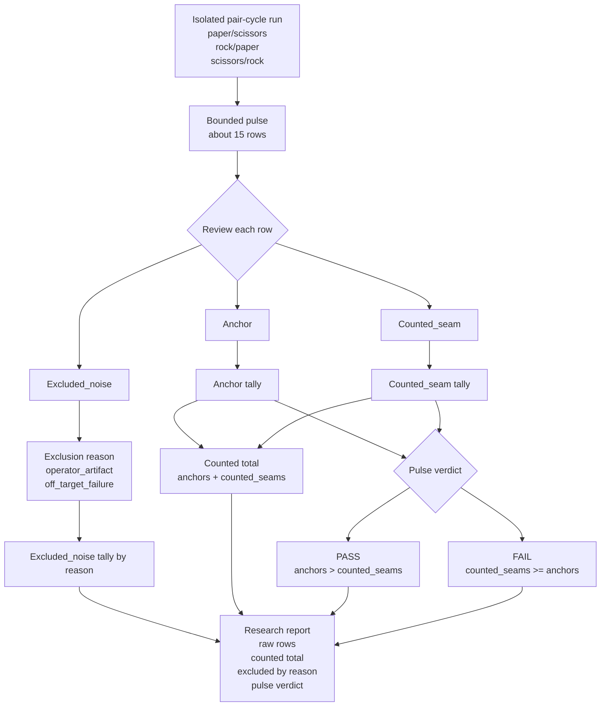
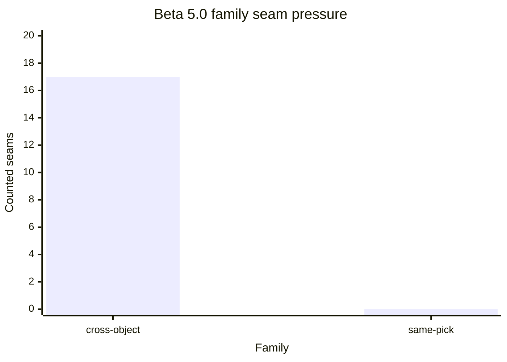

<!-- @format -->

# Research Beta 5.0: Fail-Pressure Pulse

| Field | Value |
| --- | --- |
| Code | `050_B-FAIL_PRESSURE_PULSE` |
| Category | `boundary` |
| Status | `closed` |
| Last evidence | `2026-05-21` |
| Owns | the bounded pulse boundary where the pulse becomes the binary unit. |

## What This Beta Asks

Should Scorey treat a bounded non-OCR run as the real binary unit once
run-level seam density matters more than single-row replay?

## Status

Closed.

The first bounded cross-object pulse closed with `8` anchors, `5`
`counted_seams`, `2` `excluded_noise`, and a `pass` verdict. That is a
stricter claim than the row-level `Beta 4.0` isolation result because the
binary unit is now the bounded run itself, not the pile of retained failed
rows inside it.

## Eval Shape

`Research Beta 5.0` keeps the isolated pair-cycle sampler from late
`Research Beta 4.0`, but changes the unit of judgement:

- bounded non-OCR run
- start small:
  - around `15` rows
- first active target family:
  - `cross-object coherence drift`
- first active pair cycle:
  - `paper/scissors`
  - `rock/paper`
  - `scissors/rock`
- row evidence is judged first as:
  - `anchor`
  - `counted_seam`
  - `excluded_noise`
- the pulse verdict is binary:
  - `PASS`
  - `FAIL`

Counted pulse rules:

- more anchors than `counted_seams`: `PASS`
- more `counted_seams` than anchors: `FAIL`
- tie: `FAIL`

Evidence taxonomy:

- `anchor`
  - route-valid row
  - preserves both picks clearly
  - shows a coherent causal mismatch between Scorey's winning state and the
    user's worse state
  - keeps the scoreboard claim on the user's losing side
- `counted_seam`
  - route-valid row
  - failure belongs to the active target family
  - row is still coherent enough to retain as live evidence
  - counts against the pulse verdict
- `excluded_noise`
  - row does not answer the target-family question cleanly enough to count
    for or against the pulse verdict

Exclusion reasons:

- `operator_artifact`
  - the row is malformed, truncated, or otherwise not honestly reviewable
- `off_target_failure`
  - the row fails for a different seam family than the active pulse target

Exclusion rules:

- raw pulse size stays visible
- counted pulse size stays visible
- every excluded row needs a narrow reason
- excluded rows stay reviewable after the pulse
- excluded rows never disappear into the verdict total

Reporting shape:

- raw rows
- anchors
- `counted_seams`
- `excluded_noise` by reason
- counted total
- pulse verdict

## Diagram

Pulse chart:

```mermaid
xychart-beta
  title "Beta 5.0 pulse pressure"
  x-axis "Pulse run" ["P1 cross", "P2 same", "P3 cross", "P4 cross", "P5 same"]
  y-axis "Rows" 0 --> 16
  bar "Anchors" [8, 15, 9, 9, 15]
  bar "Counted seams" [5, 0, 6, 6, 0]
  bar "Excluded noise" [2, 0, 0, 0, 0]
```

Reading note:

- the pair cycle defines the family under pressure
- raw rows are everything inside the bounded pulse
- only `anchor` and `counted_seam` rows enter the verdict math
- `excluded_noise` stays visible by reason, but does not alter the counted
  total
- the report has to show both the pulse verdict and how that verdict was made

## What It Showed

The first real `Beta 5.0` pulse is now closed on the isolated cross-object
family after output `20216`:

| Pulse | Family | Range | Raw | Anchors | `counted_seams` | `excluded_noise` | Counted total | Verdict |
| ---: | --- | --- | ---: | ---: | ---: | ---: | ---: | --- |
| `1` | `cross-object coherence drift` | `20217-20231` | `15` | `8` | `5` | `2` | `13` | `pass` |

| Pulse `1` exclusion reason | Count |
| --- | ---: |
| `operator_artifact` | `2` |
| `off_target_failure` | `0` |

Inside that first pulse:

- `paper/scissors` mostly held as anchors
- `rock/paper` mostly held as anchors
- `scissors/rock` carried most of the `counted_seam` pressure

That result matters against the closed `Beta 4.0` baseline on the same family.

The isolated row-level `Beta 4.0` cross-object run closed at:

- `77` route pass
- `50` tone pass
- `27` tone fail
- `27` retain
- `0` evict

`Beta 4.0` proved the family stayed coherent under isolation.

`Beta 5.0` now asks the stricter question and gets a different kind of answer:

- not just whether failures stayed retain-worthy
- but whether seam density inside a bounded pulse still outweighs the anchors

On the first bounded pulse, it did not. The pulse passed.

The second real `Beta 5.0` pulse then moved directly onto the smaller
same-pick seam after output `20231`:

| Pulse | Family | Range | Raw | Anchors | `counted_seams` | `excluded_noise` | Counted total | Verdict |
| ---: | --- | --- | ---: | ---: | ---: | ---: | ---: | --- |
| `2` | `same-pick object-shape drift` | `20232-20246` | `15` | `15` | `0` | `0` | `15` | `pass` |

That result is even stronger than pulse `1`.

The first bounded same-pick pulse did not just pass. It collapsed the seam:

- no counted seam pressure
- no exclusion noise
- full same-pick anchor sweep

So the early `Beta 5.0` read is now sharper:

- cross-object coherence drift still holds as the live weak family under
  pressure, even though pulse `1` passed
- same-pick object-shape drift does not currently behave like an active pulse
  family at all

The third real `Beta 5.0` pulse then repeated the first cross-object family
instead of widening immediately:

| Pulse | Family | Range | Raw | Anchors | `counted_seams` | `excluded_noise` | Counted total | Verdict |
| ---: | --- | --- | ---: | ---: | ---: | ---: | ---: | --- |
| `3` | `cross-object coherence drift` | `20247-20261` | `15` | `9` | `6` | `0` | `15` | `pass` |

That repeat matters more than the raw `pass` label.

It shows the same family still carrying real pressure under repetition:

- no operator washout
- no off-target exclusion padding
- all `15` rows stayed countable
- the weaker seam remained visible as counted pressure instead of collapsing

The fourth real `Beta 5.0` pulse then repeated the same cross-object family
one more time instead of widening yet:

| Pulse | Family | Range | Raw | Anchors | `counted_seams` | `excluded_noise` | Counted total | Verdict |
| ---: | --- | --- | ---: | ---: | ---: | ---: | ---: | --- |
| `4` | `cross-object coherence drift` | `20262-20276` | `15` | `9` | `6` | `0` | `15` | `pass` |

That fourth pass matters because it held the exact same pressure profile as
pulse `3`.

So the four-pulse picture is now:

| Pulse | Family | Read | Verdict |
| ---: | --- | --- | --- |
| `1` | cross-object | `8 / 5 / 2` | `pass` |
| `2` | same-pick | `15 / 0 / 0` | `pass` |
| `3` | cross-object | `9 / 6 / 0` | `pass` |
| `4` | cross-object | `9 / 6 / 0` | `pass` |

The fifth real `Beta 5.0` pulse then repeated the same-pick family instead of
opening a new seam:

| Pulse | Family | Range | Raw | Anchors | `counted_seams` | `excluded_noise` | Counted total | Verdict |
| ---: | --- | --- | ---: | ---: | ---: | ---: | ---: | --- |
| `5` | `same-pick object-shape drift` | `20277-20291` | `15` | `15` | `0` | `0` | `15` | `pass` |

That fifth pass matters because it repeated the same collapse as pulse `2`.

So the five-pulse picture is now:

| Family | Pulse read |
| --- | --- |
| cross-object | `8 / 5 / 2`, then `9 / 6 / 0`, then `9 / 6 / 0` |
| same-pick | `15 / 0 / 0`, then `15 / 0 / 0` |

Family-pressure chart:

## Why It Matters

This is a method change, not just a reporting layer.

`Research Beta 4.0` kept the row as the terminal binary unit:

- row-level `PASS / FAIL`
- row-level `RETAIN / EVICT`

`Research Beta 5.0` moves the binary unit up one level:

- row-level evidence labels
- pulse-level `PASS / FAIL`

That makes bounded run claims harder to fake:

- one lucky row cannot carry the whole run
- seam density has to survive a counted pulse
- exclusions stay auditable instead of disappearing into the total
- weaker-looking families can collapse quickly instead of consuming long
  row-level review queues
- repeated pulses can show whether a weak family is actually durable or only
  looked noisy in one bounded slice

## What It Still Cannot Show

- whether cross-object coherence drift will keep passing across repeated pulses
- whether `same-pick object-shape drift` will stay collapsed across repeated
  pulses instead of reappearing later
- whether exclusion rates stay low outside this first pulse
- whether repeated pulse closeout keeps the legacy tone lane fully settled
  instead of reintroducing queue residue
- whether cross-object coherence drift will eventually fail at the pulse level
  if counted seam pressure keeps persisting under repetition
- whether the repeated `9 / 6 / 0` cross-object profile is now stable enough
  to widen to a new family
- whether the repeated `15 / 0 / 0` same-pick profile is now stable enough to
  leave that family closed for a while

## What Changed Next

`Beta 5.0` is now stable enough to widen carefully without promoting the next
lens too early.

The next staged lane is scoreboard judgement:

- still row-level
- still bounded by the same isolated source shape
- still staged, not active `Beta 6.0`

The first bounded scoreboard source pass after output `20291` already happened:

- range: `20292-20306`
- `15` scoreboard pass
- `0` scoreboard fail

That source pass mattered because it exposed the remaining scoreboard seam:

- bounded scoreboard review was real
- but bounded scoreboard closeout was not yet explicit
- untouched tone rows in-range had to be settled manually

That seam is now formalized with `eval-scoreboard-close`.

So the next clean kernel is no longer another pulse repeat. The scoreboard lane
has now been staged twice on bounded cross-object source runs:

- `20292-20306`: `15` scoreboard pass, `0` scoreboard fail
- `20307-20321`: `15` scoreboard pass, `0` scoreboard fail

The second run mattered more than the first because it closed on the explicit
scoreboard-close surface:

- range closeout succeeded cleanly
- `15` untouched tone rows were settled automatically
- runtime returned to `0` pending across route, tone, and disposition

That promotion decision is now resolved.

The two bounded scoreboard passes were enough to activate `Research Beta 6.0`
as the next lens:

- `20292-20306`: `15` scoreboard pass / `0` scoreboard fail
- `20307-20321`: `15` scoreboard pass / `0` scoreboard fail

So `Beta 5.0` now closes as the pulse baseline for comparison, and the next
real work moves onto active scoreboard judgement.
