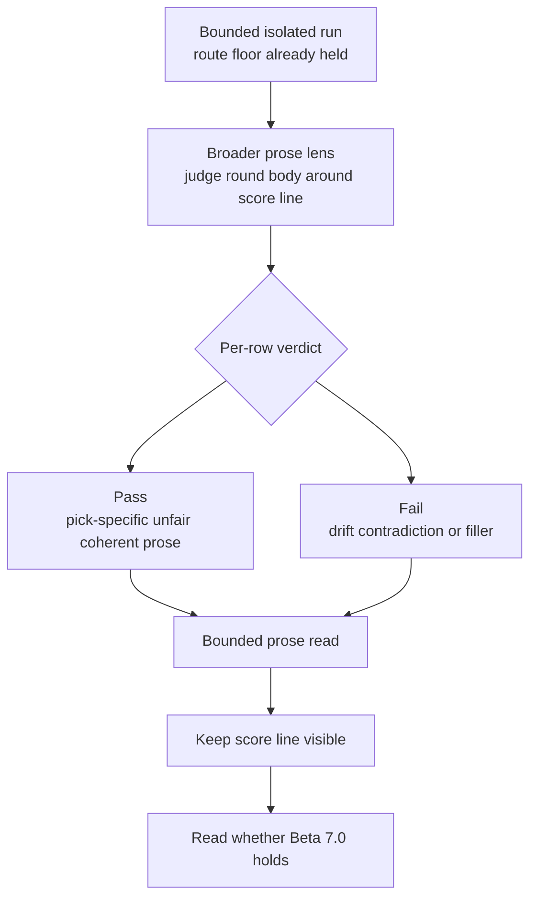

<!-- @format -->

# Research Beta 7.0: Broader Prose Judgement

| Field | Value |
| --- | --- |
| Code | `070_B-BROADER_PROSE_JUDGEMENT` |
| Category | `boundary` |
| Status | `closed` |
| Last evidence | `2026-05-22` |
| Owns | the broader prose judgement boundary above `scoreboard_claim`. |

## What This Beta Asks

Once scoreboard judgement has collapsed cleanly on the tested families, what
reopens when Scorey widens the next lens from `scoreboard_claim` to the broader
round prose?

## Status

Closed, and broader prose reopened the old cross-object seam at a stable
`9 / 6` split while same-pick stayed collapsed.

`Research Beta 7.0` is now closed because the broader prose lane is no longer
just staging. It now has:

- a locked row-level prose contract
- explicit bounded closeout on `eval-prose-close`
- a real bounded prose contrast:
  - `20352-20366`: `9` pass / `6` fail
  - `20367-20381`: `15` pass / `0` fail
  - `20382-20396`: `9` pass / `6` fail

That opening contrast matters because the lower scoreboard lane had already
collapsed twice at `15 / 0` on both tested families. The broader prose lens
reintroduced pressure only when the family was cross-object, and the same
pressure shape repeated on replay.

## Eval Shape

`Research Beta 7.0` keeps the route floor and bounded isolated run shape from
`Research Beta 6.0`, but widens the judged object:

- keep route validity as the floor
- keep bounded isolated runs
- keep the live pair-cycle sampler
- keep the score line visible
- judge the broader round prose around the score line
- keep the verdict row-level on the first pass

First active source family:

- `cross-object coherence drift`

Why that family first:

- it carried the real pulse pressure in `Beta 5.0`
- scoreboard then collapsed cleanly on it in `Beta 6.0`
- it is the sharpest place to test whether broader prose reintroduces drift

First active prose question:

- does the round body stay pick-specific, causal, unfair, and coherent once
  the judged surface widens beyond `scoreboard_claim`?

Row verdict:

- `pass`
- `fail`

Pass rules:

- the round body preserves both picks clearly
- the causal mismatch stays coherent
- the prose stays compact and unfair
- the round does not drift into generic filler
- the broader prose does not contradict the score line

Fail shape:

- generic filler or empty menace
- object-shape drift or cross-object causal drift
- contradiction between the prose and the visible score line
- prose broad enough to lose the rigged round logic

Packaging decision:

- keep the bounded run shape for sourcing rows
- do not reopen pulse verdict math on the first prose pass
- judge prose row by row first

## Diagram

Run chart:

```mermaid
xychart-beta
  title "Beta 7.0 prose contrast"
  x-axis "Bounded run" ["cross 1", "same", "cross 2"]
  y-axis "Rows" 0 --> 16
  bar "Pass" [9, 15, 9]
  bar "Fail" [6, 0, 6]
```

Reading note:

- this lens is wider than scoreboard
- it still stays narrower than a vague whole-round vibe check
- the score line remains visible as context
- the verdict stays row-level on the prose body
- it does not erase the closed pulse and scoreboard baselines underneath it

## What It Showed

The first three bounded `Beta 7.0` prose runs are now closed after output
`20381`:

| Run | Family | Range | Prose pass | Prose fail |
| --- | --- | --- | ---: | ---: |
| first bounded source pass | cross-object | `20352-20366` | `9` | `6` |
| second bounded source pass | same-pick | `20367-20381` | `15` | `0` |
| third bounded source pass | cross-object | `20382-20396` | `9` | `6` |

The fail mix in the cross-object run was the old seam again:

| Fail family | Read |
| --- | --- |
| repeated seam | cross-object causal drift |
| strongest pocket | `scissors/rock` |

The same-pick run collapsed cleanly the way same-pick had already collapsed at
the scoreboard layer:

- no same-pick object-shape drift reopened
- no contradiction against the visible score line
- no generic filler broad enough to fail the row

And both closeouts proved the new operator surface end to end:

| Closeout proof | Read |
| --- | --- |
| bounded prose ranges | closed cleanly |
| untouched tone rows | `15` settled on each range |
| untouched scoreboard rows | `15` settled on each range |
| runtime state | returned to `0` pending |

That matters beyond `Beta 7.0` itself:

- the newer bounded eval gates are holding up cleanly across transitions
- pulse closeout, scoreboard closeout, and prose closeout have all stayed
  legible and bounded
- the repo can widen again without feeling like the operator surface is
  fraying underneath it

That is the important contrast against the closed `Beta 6.0` surface:

| Layer | Cross-object | Same-pick |
| --- | --- | --- |
| scoreboard | `15 / 0`, then `15 / 0` | `15 / 0`, then `15 / 0` |
| broader prose | `9 / 6`, then `9 / 6` | `15 / 0` |

Layer-contrast chart:

```mermaid
xychart-beta
  title "Beta 6 to Beta 7 pressure shift"
  x-axis "Judgement layer" ["scoreboard", "broader prose"]
  y-axis "Fail rows" 0 --> 7
  bar "Cross-object" [0, 6]
  bar "Same-pick" [0, 0]
```

So the cross-object seam was never truly gone. It was just narrower than the
scoreboard lane, and same-pick still looks structurally sound under the wider
prose lens.

## Why It Matters

Broader prose judgement is earning a real beta boundary because it changes what
the evidence means.

Scoreboard judgement told us that the explicit score-side fragment could hold
cleanly. `Beta 7.0` shows that this does not guarantee the broader round body
holds once the judged surface widens above that fragment.

That gives the repo a sharper layered story:

- pulse found where the durable weak family lived
- scoreboard proved the explicit score fragment could collapse cleanly
- broader prose shows the cross-object seam still reappears in the larger round
  body
- broader prose shows same-pick is still collapsed even after the judged
  surface widens
- broader prose now shows the cross-object seam is stable enough to repeat as a
  bounded pressured shape, not just a one-off flare

## What It Still Cannot Show

- whether a narrower menace-quality lens changes the verdict meaning again
- whether the full visible round can be judged as compact rigged-round menace
  without smuggling in smugness, cruelty, or filler

## What Changed Next

`Research Beta 7.0` is closed now, and the next clean questions are:

1. compare the now-closed prose contrast directly against the closed `Beta 6.0`
   scoreboard collapse:
   - cross-object scoreboard: `15 / 0`, then `15 / 0`
   - same-pick scoreboard: `15 / 0`, then `15 / 0`
   - cross-object prose: `9 / 6`, then `9 / 6`
   - same-pick prose: `15 / 0`
2. use that cleaner gate confidence to stage `pre-Beta 8.0` as menace
   judgement:
   - not mean
   - not smug
   - not condescending
   - just a compact little rigged-round menace
