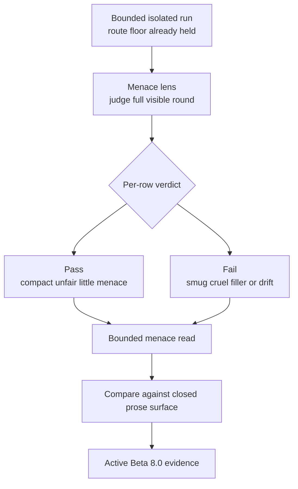

<!-- @format -->

# Research Beta 8.0: Menace Judgement

| Field | Value |
| --- | --- |
| Code | `080_B-MENACE_JUDGEMENT` |
| Category | `boundary` |
| Status | `active` |
| Last evidence | `2026-06-06` |
| Owns | the active menace-judgement boundary on the full visible round. |

## What This Beta Asks

Once broader prose has stabilised as the live weak surface, does the full
visible round land as the right kind of compact rigged-round menace rather than
only as structurally coherent prose?

## Status

Active.

`Research Beta 8.0` starts here because the menace lane is now both real and
meaningfully different from the closed `Beta 7.0` prose surface:

- the menace operator lane is locked
- menace closeout returns to `0` pending cleanly
- the first bounded menace read repeated the cross-object pressure
- the second bounded menace read moved above prose and changed what the
  evidence means

Bounded menace reads:

| Range | Family | Menace read | Closeout |
| --- | --- | --- | --- |
| `20307-20321` | `cross-object coherence drift` | `11` pass / `4` fail | `pending=0`; `tone=0`; `scoreboard=0`; `prose=15` |
| `20382-20396` | `cross-object coherence drift` | `9` pass / `6` fail | `pending=0`; `tone=0`; `scoreboard=0`; `prose=0` |
| `20352-20366` | `cross-object coherence drift` | `11` pass / `4` fail | `pending=0`; `tone=0`; `scoreboard=0`; `prose=0` |
| `20367-20381` | `same-pick coherence drift` | `15` pass / `0` fail | `pending=0`; `tone=0`; `scoreboard=0`; `prose=0` |

Meaning shift:

- under `Beta 7.0`, both cross-object prose slices held at `9 / 6`
- under `Beta 8.0`, one cross-object menace slice still held `9 / 6`
- two later cross-object menace slices improved to `11 / 4`
- same-pick menace still collapses cleanly at `15 / 0`
- so menace is not just restating prose coherence; some prose-fail rows still
  land as the right kind of tiny menace while same-pick stays fully collapsed

## Eval Shape

`Research Beta 8.0` keeps the bounded isolated run shape from `Beta 7.0`, but
widens the judged question again:

- keep route validity as the floor
- keep bounded isolated runs
- keep the live pair-cycle sampler
- keep the score line visible
- keep the broader round body visible
- judge the quality of the round's menace as a row-level lens on the full
  visible round

Active contrast:

- `cross-object coherence drift`
- `same-pick coherence drift`

Active row verdict:

- `pass`
- `fail`

| Verdict | Signal |
| --- | --- |
| `pass` | the round feels unfair in a compact deliberate way; the menace is playful not mean; the voice is confident without sounding smug or superior; the pressure stays pick-specific and round-specific; the round does not bloat into explanation, lecturing, or generic aggression |
| `fail` | smug or superiority-performing voice; condescending or lecturey phrasing; generic aggression or insult without rigged-round character; prose too padded to feel like a tiny menace; structural drift severe enough that menace quality cannot be judged honestly |

## Diagram

Menace read chart:

```mermaid
xychart-beta
  title "Beta 8.0 menace reads"
  x-axis "Bounded read" ["20307-20321", "20382-20396", "20352-20366", "20367-20381"]
  y-axis "Fail rows" 0 --> 7
  bar "Menace fail rows" [4, 6, 4, 0]
  bar "Closed prose fail rows" [6, 6, 6, 0]
```

## What Changed

This beta changes the evidence question from:

| From | To |
| --- | --- |
| does the broader round body still hold its rigged logic? | does the broader round body feel like the right kind of Scorey menace? |

That difference now has live evidence behind it.

## Why It Matters

This is the first active boundary that directly measures the thing people are
actually responding to:

- not just prose validity
- not just scoreboard pressure
- but the tiny unfair charm of Scorey itself

Two cross-object reads now show that menace can still hold even when the
broader prose lane marked the same slice as weaker. The first same-pick menace
read also stayed fully collapsed, which keeps the family split sharp instead of
widening into noise.

## What It Still Needs

- a decision on whether there is a sharper staged lane above menace
- evidence that the menace lane can stay distinct without drifting into cruelty
  or generic hostility

## What Would Close It

`Research Beta 8.0` should close only when:

- the menace contrast is stable enough to read cleanly across tested families
- the runtime keeps returning to `0` pending after bounded menace runs
- the repo has a clear next staged question above menace, or a clear stop
  point
