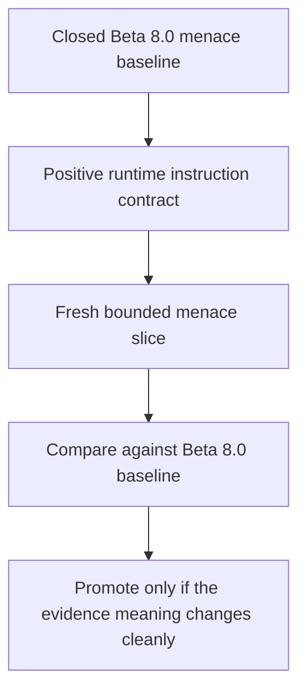

<!-- @format -->

# Pre-Beta 9.0: Positive Runtime Instruction Contract

| Field | Value |
| --- | --- |
| Code | `410_PB-POSITIVE_RUNTIME_INSTRUCTION_CONTRACT` |
| Category | `boundary` |
| Status | `staged` |
| Last evidence | `2026-06-09` |
| Owns | the staged runtime-instruction contract above the closed menace baseline. |

## Boundary

`Research Beta 8.0` is the frozen menace baseline. Its bounded reads remain the
source for the current menace comparison surface.

`pre-Beta 9.0` names the next runtime contract before new live menace evidence
is cut. The first fresh bounded menace slice under the rewritten contract is
the point where a new beta can earn promotion.

The active question is whether Scorey can keep the menace lane once the live
runtime contract becomes fully agent-local and framed as positive target
behaviour rather than prohibition piles.

## Diagram

## Contract

- `src/scorey/config.py` stays structural only:
  - fixed picks
  - route rules
  - settings
  - environment loading
- `src/scorey/agent.py` owns the live runtime instruction shape:
  - structured field contract
  - route-family guidance
  - positive target behaviour for the three unstable fields
- live instructions describe the wanted output positively:
  - lowercase fragments
  - clear Scorey win and user loss
  - concrete physical mismatch
  - pick-specific playful menace
  - same-pick rounds as two unequal copies of one object
  - `scoreboard_claim` on the user's losing side of the score line
- new live evidence belongs above this contract rewrite and should not be
  appended to the closed Beta 8.0 baseline

## Evidence Stack

The staged contract keeps this evidence order:

1. Closed `Research Beta 8.0` menace reads as the frozen baseline.
2. The rewritten agent-local prompt contract in `src/scorey/agent.py`.
3. Fresh bounded menace slices gathered only after the prompt rewrite lands.
4. A new beta boundary only if the post-rewrite evidence changes meaning
   cleanly against the Beta 8.0 baseline.

## First Kernel Shape

The first pre-Beta 9.0 kernel should be small, explicit, and comparable.

It should record:

- the live agent contract now in `src/scorey/agent.py`
- the closed Beta 8.0 baseline it is being compared against
- at least one fresh bounded cross-object menace slice
- row-level menace verdicts plus closeout counts
- whether same-pick still collapses cleanly if that family is reopened

## Decision Rule

`pre-Beta 9.0` can promote only when fresh post-rewrite menace evidence is
strong enough that the new contract changes what the bounded reads mean. Until
then, Beta 8.0 remains the frozen baseline and the staged contract remains the
current tracked research surface.
