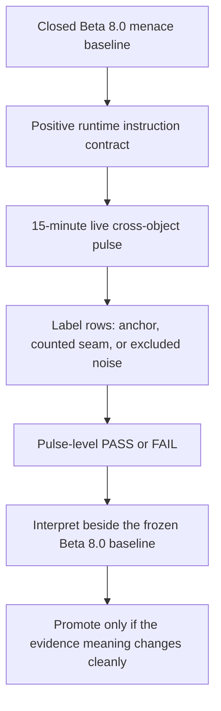

<!-- @format -->

# Pre-Beta 9.0: Positive Runtime Instruction Contract

| Field | Value |
| --- | --- |
| Code | `410_PB-POSITIVE_RUNTIME_INSTRUCTION_CONTRACT` |
| Category | `boundary` |
| Status | `staged` |
| Last evidence | `2026-06-09` |
| Owns | the staged runtime-instruction contract and its first fresh `15`-minute pulse above the closed menace baseline. |

## Boundary

`Research Beta 8.0` is the frozen menace baseline. Its bounded reads remain the
source for the current menace comparison surface.

`pre-Beta 9.0` names the next runtime contract and the evidence rule that tests
it. The first fresh `15`-minute live cross-object pulse under the rewritten
contract is the point where a new beta can earn promotion.

The active question is whether Scorey can keep cross-object coherence during
that sustained pulse once the live runtime contract becomes fully agent-local
and framed as positive target behaviour rather than prohibition piles.

## Diagram

## Contract

- `src/scorey/config.py` stays structural only:
  - fixed picks
  - route rules
  - settings
  - environment loading
- `src/scorey/agent.py` owns the live runtime instruction shape:
  - structured field contract
  - route-family guidance
  - positive target behaviour for the three unstable fields
- live instructions describe the wanted output positively:
  - lowercase fragments
  - clear Scorey win and user loss
  - concrete physical mismatch
  - pick-specific playful menace
  - same-pick rounds as two unequal copies of one object
  - `scoreboard_claim` on the user's losing side of the score line
- new live evidence belongs above this contract rewrite and should not be
  appended to the closed Beta 8.0 baseline
- the first fresh evidence run is one `15`-minute live cross-object pulse:
  - only route-pass rows enter
  - each row is labelled `anchor`, `counted_seam`, or `excluded_noise`
  - `PASS` requires more anchors than counted seams; a tie is `FAIL`
  - `excluded_noise` needs a supported narrow reason and does not affect the
    verdict
  - `retain` and `evict` do not apply to this pulse

## Evidence Stack

The staged contract keeps this evidence order:

1. Closed `Research Beta 8.0` menace reads as the frozen baseline.
2. The rewritten agent-local prompt contract in `src/scorey/agent.py`.
3. One fresh `15`-minute live cross-object pulse gathered only after the prompt
   rewrite lands.
4. A binary pulse result, with the row evidence and any exclusions still
   inspectable.
5. A new beta boundary only if the post-rewrite evidence changes meaning
   cleanly against the Beta 8.0 baseline.

## First Kernel Shape

The first pre-Beta 9.0 kernel should be small, explicit, and comparable.

It should record:

- the live agent contract now in `src/scorey/agent.py`
- the closed Beta 8.0 baseline it is being compared against
- one fresh `15`-minute live cross-object pulse
- the actual UTC sampling window and output-id range
- row labels, exclusion reasons, and the binary pulse result
- pulse closeout at `0` pending
- no same-pick reopening unless a later kernel explicitly authorises it

## Decision Rule

`pre-Beta 9.0` can promote only when the completed post-rewrite pulse is strong
enough, alongside the frozen Beta 8.0 baseline, to change what the evidence
means. Until then, Beta 8.0 remains frozen and the staged contract plus pulse
rule remains the current tracked research surface.
