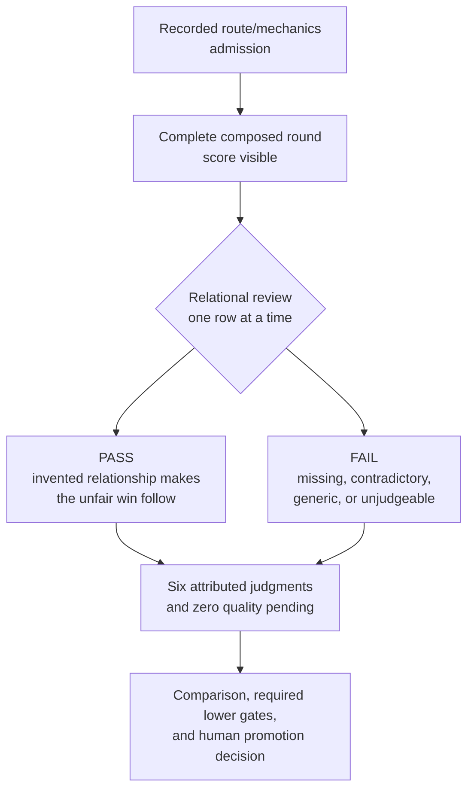

<!-- @format -->

# Pre-Beta 9.0: Coherent Absurdity

| Field | Value |
| --- | --- |
| Code | `420_PB-COHERENT_ABSURDITY` |
| Category | `boundary` |
| Status | `paused` |
| Last evidence | `2026-09-21` |
| Owns | the paused relational inquiry and its recorded experimental review condition. |

## What This Pre-Beta Asks

Does the invented relationship make Scorey's unfair win follow? The recorded
experiment used `coherent-absurdity-review-1`: one complete composed round, with the score
visible, judged through `winning_state` and `worse_state` together.

## Status

Paused under D-045. All six original rounds passed mechanical checks and
received human `FAIL` judgments about voice and behaviour. The generation
instructions are restored from `321d970`. The engineering rubric and proposed
review flow below remain recorded for protocol alignment; they do not authorize
further implementation, generation, or promotion. The imported criteria snapshot
and human verdicts remain unchanged.

## Eval Shape

Recorded route and mechanical checks admit the round; they remain separate from
the relational verdict. Preserve D-039's route, object, tone, pulse, scoreboard,
prose, and menace order and each lens's disposition. This review does not insert
a new gate or import Beta 5 pulse math into six row judgments.

D-043's additive review surface uses `review_datasets`, `review_cases`, and
`review_events` in the existing eval database without changing historical
`eval_*` rows. The reader opens the imported dataset read-only and saves a
source-bound `.notes.json` sidecar; an explicit importer appends its events to
`review_events`. Each case remains bound to its response ID and receipt hash.
Each observation or judgment event also carries the dataset ID, manifest hash,
criteria ID and hash, author, UTC time, source, note, and field-or-phrase
location. An observation has no verdict; a judgment requires `PASS` or `FAIL`.

The engineering rubric interpreted the [endorsed question](../peanut/research/2026-09-21-coherent-absurdity.md)
using the [earlier prose contract](./070_B-BROADER_PROSE_JUDGEMENT.md#eval-shape)
and D-041's experimental prompt. That interpretation now requires alignment.

`PASS` requires both picks to remain legible; one coherent imagined property,
power, role, or transformation to connect the picks; fragments that fit the
same relationship; an easy-to-picture causal bridge to the unfair win; and no
contradiction with the visible score. A transformation is not automatically
off-pick: the link to the actual selections must remain legible. `FAIL` records
the missing, contradictory, generic, or unjudgeable relationship. A missing or
incomplete response is a mechanical failure, not an invented semantic verdict.
Playful-menace and scoreboard quality stay separate; no whole-round `PASS` is
inferred. The four supplied examples remain concept references only.

## Diagram

Proposed review flow from the paused experiment; not an active protocol.

The method is linked to the [golden-smoke diagram](../diagrams/GOLDEN_SMOKE.md)
and the [smoke-integrity snapshot](./300_VALIDATION-GOLDEN_SMOKE.md).

## What This Would Change

It gives the current coherent-absurdity inquiry a named, staged boundary above
Beta 8 and beside the earlier historical staging in [410](./410_PB-POSITIVE_RUNTIME_INSTRUCTION_CONTRACT.md).
It does not relabel the six smoke rounds or close any historical lens.

## Why It Matters

The human's relational question remains research context. D-045 restores the
established generation contract while preserving the experiment and attributed
review. The original protocol governs the next aligned adjustment.

## Recorded Proposal

The following requirements were the engineering proposal, now paused. D-044
already superseded its mandatory reason requirement; reasons remain optional.

- six attributed `PASS`/`FAIL` judgments with criteria, judge, reason, and IDs;
- an imported review dataset preserving the manifest, criteria, complete
  receipts, raw request/response bytes and hashes, picks, composed text,
  settings, timing, and token data;
- source-bound `.notes.json` events that preserve the response ID, receipt hash,
  criteria ID and hash, author, UTC time, verdict or observation kind, note, and
  reason/field location, then append explicitly to `review_events`;
- exact counts and source checks, with the original run read-only;
- zero quality pending and no invented all-pass or rate threshold.

## What Would Promote It

Resume only after source-backed alignment on Polinko's established method and
Scorey's golden user/assistant pairs. D-039's ordered gates remain unchanged:
Beta 1 is complete and Beta 2 has not started. The paused D-042 formalization
does not establish a new promotion rule.
