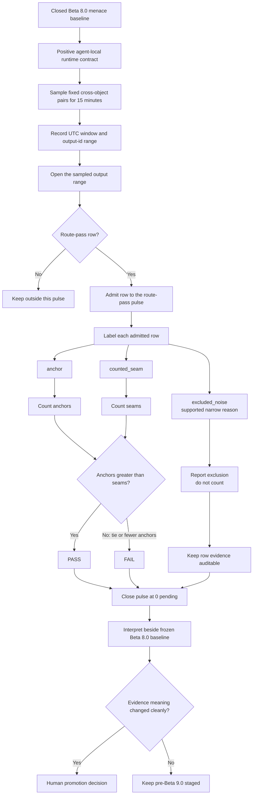

<!-- @format -->

# Pre-Beta 9.0: Pulse Evaluation Method

| Field | Value |
| --- | --- |
| Code | `420_PB-PULSE_EVALUATION_METHOD` |
| Category | `boundary` |
| Status | `staged` |
| Last evidence | `2026-09-18` |
| Owns | the route-pass admission, labelling, binary verdict, closeout, and interpretation method for the first fresh pre-Beta 9.0 pulse. |

## What This Pre-Beta Asks

Can the positive runtime contract hold across one fresh, sustained
cross-object pulse when the verdict is strictly `PASS` or `FAIL`?

## Status

Staged. `Research Beta 8.0` remains the frozen menace baseline. This method
does not reopen its evidence or turn the pulse into a `retain` / `evict`
workflow.

## Eval Shape

The first pre-Beta 9.0 evidence unit is one `15`-minute live cross-object
pulse under the agent-local positive runtime contract.

- only route-pass rows enter the pulse
- record the UTC sampling window and output-id range
- label each admitted row as `anchor`, `counted_seam`, or `excluded_noise`
- every `excluded_noise` row needs a supported narrow reason and remains
  inspectable
- only anchors and counted seams enter the verdict
- `PASS` requires more anchors than counted seams; a tie is `FAIL`
- close the pulse with `0` pending before interpretation

## Diagram

## What This Would Change

The method makes the pulse, rather than a row disposition, the binary unit of
evidence. It preserves excluded rows as audit evidence without allowing them
to alter the anchor-versus-seam verdict.

A completed `PASS` or `FAIL` is evidence, not promotion on its own. Promotion
remains a human interpretation of whether the fresh pulse changes what the
frozen Beta 8.0 baseline means.

## Why It Matters

The method separates three decisions that should not be conflated:

- whether a row belongs in this pulse
- whether an admitted row counts for, against, or outside the verdict
- whether the completed pulse changes the beta boundary

That separation keeps the live evidence legible and prevents an exclusion or
a row-level disposition from quietly deciding the next research boundary.

## What It Still Needs

- one live `15`-minute cross-object pulse after the positive runtime contract
  is in place
- the actual UTC window, output-id range, labels, and exclusion reasons
- clean closeout at `0` pending
- human comparison with the frozen Beta 8.0 menace baseline

## What Would Promote It

This staged method can support a new beta only when the completed pulse and
the frozen Beta 8.0 baseline together change the evidence meaning cleanly.
Until then, the runtime contract and this evaluation method remain staged.
