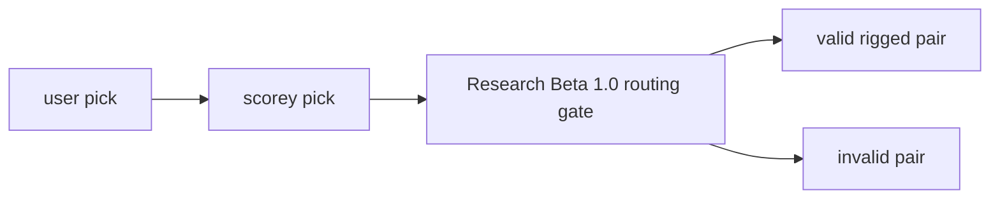

# Research Beta 1.0: Pick Routing First

## What This Beta Asked

Does Scorey choose a valid rigged route for the selected user pick?

## Short Answer

Yes.

The first gate held once the eval lane stopped treating the three local
fixtures as if they were the whole pass table.

## Eval Shape

- judge the pick pair only
- read rows in `scorey_pick, user_pick` order
- `pass`:
  - `paper, scissors`
  - `rock, paper`
  - `scissors, rock`
  - `paper, paper`
  - `rock, rock`
  - `scissors, scissors`
- `fail`:
  - every other `scorey_pick, user_pick` pair

## Current Signal

- the first long local soak proved the storage lane and gate:
  - `3578` local rows
  - all pass
  - only three valid pass pairs appeared
- the six-pair coverage sampler then closed the full table:
  - `3582` `local-research-beta-1-coverage-batch` rows
  - `597` rows for each valid pass pair
  - newest readback stayed all-pass

## Why It Matters

This beta proved more than “Scorey can pass.”

It established a stable deterministic coverage lane for the full routing table,
which made later object and tone questions worth asking.

## What Changed Next

Once the full pass table was stable, the next question stopped being “is the
route valid at all?” and became “can one object stay stable when it is
isolated across both roles?”
