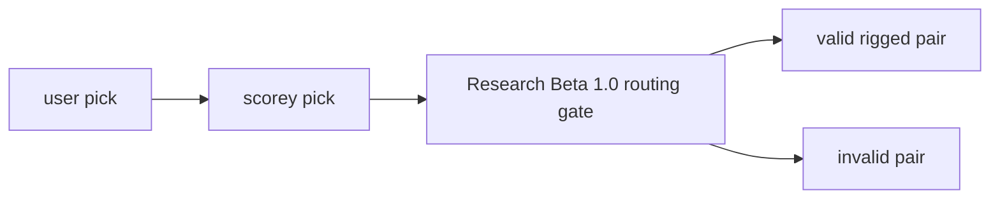

# Research Beta 1.0: Pick Routing First

## What This Beta Asked

Does Scorey choose a valid rigged route for the selected user pick?

## Short Answer

Yes. The first gate held once the eval lane stopped treating the three local fixtures as if they were the whole pass table.

## Eval Shape

`Research Beta 1.0` judges the pick pair only.

It reads every row in `scorey_pick, user_pick` order.

- `pass`:
  - `paper, scissors`
  - `rock, paper`
  - `scissors, rock`
  - `paper, paper`
  - `rock, rock`
  - `scissors, scissors`
- `fail`:
  - every other `scorey_pick, user_pick` pair

What stays out of scope:

- round prose
- tone
- scoreboard claim

## Diagram

## What It Showed

The first long local soak proved the storage lane and gate, but only hit a narrow deterministic subset:

- `3578` local rows
- all pass
- only three valid pass pairs appeared

That led to the six-pair coverage sampler:

- `3582` `local-research-beta-1-coverage-batch` rows
- `597` rows for each valid pass pair
- newest readback stayed all-pass

So the result of `Research Beta 1.0` is not just that Scorey can pass. It is that the full pass table now has a stable deterministic coverage lane.

## What It Could Not Show

- live model behaviour
- round prose quality
- tone stability
- scoreboard quality

## What Changed Next

Once the full pass table was stable, the next question stopped being “is the route valid at all?” and became “can one object stay stable when it is isolated across both roles?”

That shift is `Research Beta 2.0`.
