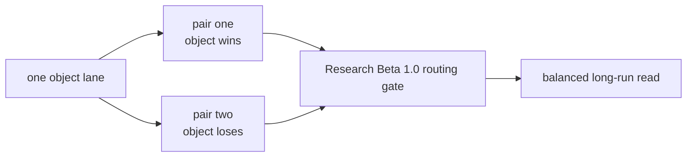

# Research Beta 2.0: Focused Object Lanes

## What This Beta Asked

Can one object stay stable when Scorey is forced to show it as both a win and a loss?

## Short Answer

Yes on the local deterministic path.

The focused pair-cycle method held cleanly across all three completed object lanes.

## Eval Shape

`Research Beta 2.0` keeps the `Research Beta 1.0` routing gate, but changes the sampling architecture.

Instead of asking for the full pass table at once, it isolates one object through an explicit local pair cycle.

For each lane:

- one pair shows the object as Scorey's winning pick
- one pair shows the same object as the user's losing pick

What stays out of scope:

- full-table coverage
- prose quality
- tone
- scoreboard claim

## Diagram

## What It Showed

The first focused rock lane produced:

- `3568` rows in the one-hour run
- `3580` total `local-explicit-pair-cycle-batch` rows including the short validation sample
- `1790` rows of `rock/paper`
- `1790` rows of `scissors/rock`

The newest readback on that lane remained all-pass under `Research Beta 1.0`.

The focused paper lane then produced:

- `3579` rows in the long run after the short validation sample
- `1790` rows of `paper/scissors`
- `1789` rows of `rock/paper`
- the newest readback on that lane remained all-pass under `Research Beta 1.0`

The focused scissors lane then produced:

- `3579` rows in the long run after the short validation sample
- `1790` rows of `scissors/rock`
- `1789` rows of `paper/scissors`
- the newest readback on that lane remained all-pass under `Research Beta 1.0`

The local deterministic queue is now fully judged:

- `17,922` pass
- `0` fail
- `0` pending
- the reviewed local notes now cover:
  - `local-fixture-batch`
  - `local-research-beta-1-coverage-batch`
  - `local-explicit-pair-cycle-batch`

So the important result here is not just balance. It is that the repo now has a clean way to isolate one object lane without inventing a new named sampler every time.

## Why It Matters

This beta separates two different questions:

- can Scorey choose a valid rigged route at all
- can one object stay stable when it appears on both sides of that rigged logic

That makes the next move cleaner. Local deterministic balance is no longer the open question.

## What It Could Not Show

- broader prose quality
- tone stability
- scoreboard judgment
- whether the live path stays stable beyond the first judged sample

## What Changed Next

All three object lanes are now complete on the local path.

The first live batch has now been recorded through the real API path:

- `12` rows
- `12` routing pass
- `0` routing fail
- `12` human pass
- `0` human fail
- `0` human pending

So the next useful move is no longer more local repetition or first-pass live review. It is widening the live queue carefully while keeping the route and legibility lens narrow, then deciding whether Scorey earns a wider prose, tone, or scoreboard-focused eval lane.
