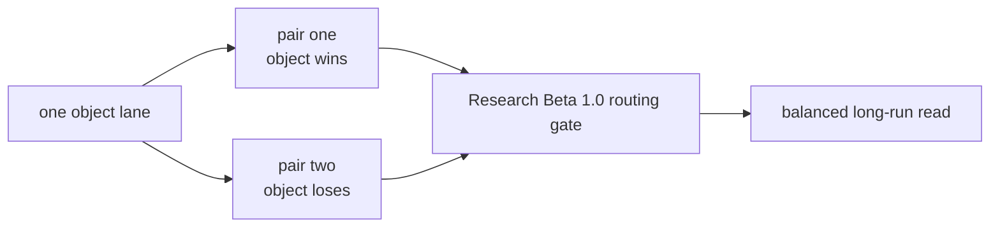

# Research Beta 2.0: Focused Object Lanes

## What This Beta Asked

Can one object stay stable when Scorey is forced to show it as both a win and
a loss?

## Short Answer

Yes on the local deterministic path.

The focused pair-cycle method held cleanly across all three completed object
lanes.

## Eval Shape

- keep the `Research Beta 1.0` routing gate
- isolate one object through an explicit local pair cycle
- for each lane:
  - one pair shows the object as Scorey's winning pick
  - one pair shows the same object as the user's losing pick

## Current Signal

- focused rock lane:
  - `1790` rows of `rock/paper`
  - `1790` rows of `scissors/rock`
- focused paper lane:
  - `1790` rows of `paper/scissors`
  - `1789` rows of `rock/paper`
- focused scissors lane:
  - `1790` rows of `scissors/rock`
  - `1789` rows of `paper/scissors`
- the local deterministic queue is fully judged:
  - `17,922 pass / 0 fail / 0 pending`
- the route-valid live read that followed stayed clean:
  - `395 pass / 0 fail / 0 pending`

## Why It Matters

This beta separated two different questions:

- can Scorey choose a valid rigged route at all
- can one object stay stable when it appears on both sides of that rigged logic

It also proved that the repo could isolate one object lane without inventing a
new named sampler every time.

## What Changed Next

Once local lane balance and the first live route-valid surface both held, the
next useful widening step was no longer more route pressure. It was a tone
question on judged live rows.
