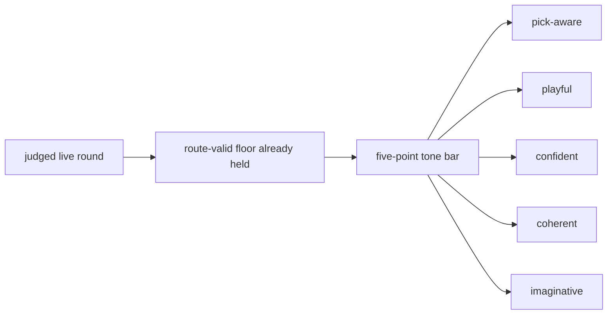

# Research Beta 3.0: Tone First

## What This Beta Asked

Can Scorey keep its own voice once route validity and pick legibility are no longer the open question?

## Short Answer

Started, separating real signal, but not settled.

The tone lane now has real separation, and the widened live tone surface is
fully dispositioned. The stale queue is closed; the next useful evidence should
come from a fresh post-archive run.

## Eval Shape

`Research Beta 3.0` keeps the live route-valid floor from the earlier betas, but changes the verdict question.

It judges each live round through five positive-only traits:

- `pick-aware`
- `playful`
- `confident`
- `coherent`
- `imaginative`

Its failure handling is now two-stage:

- `PASS / FAIL` at the tone gate
- if `FAIL`, then `RETAIN / EVICT`

What stays out of scope:

- scoreboard judgement as its own lane
- broader prose judgement as its own lane

## Diagram

## What It Showed

This beta has now started, and the first widened tone queue is not an all-pass surface.

Its starting surface was the already-judged live queue:

- `395` live rows
- `395` beab pass under the current narrow route-and-legibility lens
- `0` fail
- `0` pending

Since then, five more extended live runs have widened the active surface:

- `12` new live rows after output `18317`
- `257` new live rows after output `18329`
- `294` new live rows after output `18586`
- `294` new paper-only live rows after output `18880`
- `170` new live rows after output `19174`
- all five runs stayed entirely inside the valid `Research Beta 1.0` route set

The current live snapshot is now:

- `1422` live rows recorded
- `1422` beab pass at the route-and-legibility floor
- `0` beab fail
- `0` pending route review
- the newest paper-only batch stayed inside the expected paper route families:
  - `paper/paper`: `144`
  - `paper/rock`: `150`
- the newest mixed run also stayed inside the valid route families:
  - `paper/paper`: `34`
  - `paper/scissors`: `24`
  - `rock/paper`: `23`
  - `rock/rock`: `29`
  - `scissors/rock`: `28`
  - `scissors/scissors`: `32`

The current tone lane now records:

- `695` rows judged
- `232` tone pass
- `463` tone fail
- `727` tone rows archived out of the active queue
- `0` route-passed live rows still pending tone review
- the first fresh post-surface live run is now fully closed:
  - `170` route pass
  - `66` tone pass
  - `104` tone fail
  - `104` evict
  - `0` fresh pending route reviews
  - `0` fresh pending tone reviews
  - `0` fresh pending fail dispositions
- historical pre-surface tone fails still remain undispositioned and should not
  be confused with the fresh active queue
- the strongest pass pattern is object-specific slapstick or physical demotion that still tracks both picks
- the weak pattern is usually either generic `real one` / `napkin` or version/copy language, with a smaller playful line that is not coherent enough to keep

Inside the paper-only lane, the first isolated judged surface is now:

- `670` route-passed paper rows total
- `514` judged paper-only tone rows
- `161` pass
- `353` fail
- `156` archived out of the active paper queue
- `0` pending
- `my paper was the real one and your paper was a napkin` is still a weak fail
- `my rock was stone-cold advantage and your paper was a napkin` is still a stronger pass
- the seam is not "napkin" by itself
- the seam is the thinner paper/paper framing around `real one`

So the open question is no longer whether Scorey stayed on-pick. It is whether Scorey sounds like Scorey once that floor is already satisfied.

## Why It Matters

Tone is the cleanest next widening step.

It is more specific than a broad prose pass, and it stays closer to the object's identity than a scoreboard-first lane would.

## What It Could Not Show

- scoreboard quality as its own judged lane
- broader prose quality as its own judged lane
- whether the five-point tone bar will stay stable across a larger judged queue
- whether later lenses will need a different sampling shape
- whether tone review can keep up once live generation widens again

## What Changed Next

The next useful move is to keep the fresh-slice closure rule in place and start
the next live run from this now-clean boundary instead of widening another stale
queue.

That now includes a sharper failure rule:

- retain failures that still belong in the active lane as live evidence
- evict failures that prove the paper seam or another lane boundary needs an
  upstream correction before rerun
