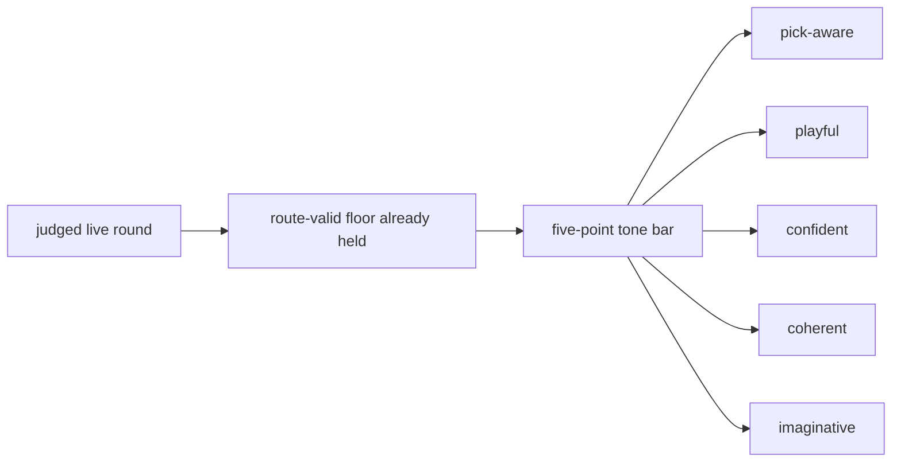

# Research Beta 3.0: Tone First

## What This Beta Asked

Can Scorey keep its own voice once route validity and pick legibility are no longer the open question?

## Short Answer

Started, promising, but not settled.

The tone lane now has real separation, and the live route floor is still holding under wider batches, but review throughput is lagging the new generation.

## Eval Shape

`Research Beta 3.0` keeps the live route-valid floor from the earlier betas, but changes the verdict question.

It judges each live round through five positive-only traits:

- `pick-aware`
- `playful`
- `confident`
- `coherent`
- `imaginative`

What stays out of scope:

- scoreboard judgement as its own lane
- broader prose judgement as its own lane

## Diagram

## What It Showed

This beta has now started, and the first widened tone queue is not an all-pass surface.

Its starting surface was the already-judged live queue:

- `395` live rows
- `395` beab pass under the current narrow route-and-legibility lens
- `0` fail
- `0` pending

Since then, two more extended live runs have widened the active surface:

- `12` new live rows after output `18317`
- `257` new live rows after output `18329`
- both runs stayed entirely inside the valid `Research Beta 1.0` route set

The current live snapshot is now:

- `664` live rows recorded
- `441` beab pass at the route-and-legibility floor
- `0` beab fail
- `223` still pending route review

The current tone lane now records:

- `18` rows judged
- `11` tone pass
- `7` tone fail
- `423` route-passed live rows still pending tone review
- the weak pattern is usually still pick-aware and coherent, but too generic or not imaginative enough

Inside the latest `257`-row run, the tandem pass has already started:

- `34` rows promoted through the route floor
- `3` tone pass
- `3` tone fail
- `28` tone pending

So the open question is no longer whether Scorey stayed on-pick. It is whether Scorey sounds like Scorey once that floor is already satisfied.

## Why It Matters

Tone is the cleanest next widening step.

It is more specific than a broad prose pass, and it stays closer to the object's identity than a scoreboard-first lane would.

## What It Could Not Show

- scoreboard quality as its own judged lane
- broader prose quality as its own judged lane
- whether the five-point tone bar will stay stable across a larger judged queue
- whether later lenses will need a different sampling shape
- whether tandem review can keep up once live generation widens again

## What Changed Next

The next useful move is to keep route review and tone review moving in tandem with live generation until the five-point bar looks stable enough to support a wider lens decision.
