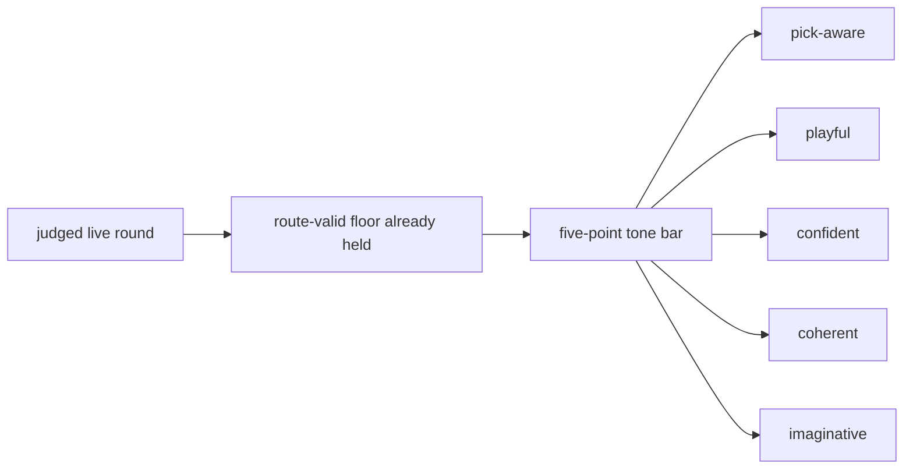

# Research Beta 3.0: Tone First

## What This Beta Asked

Can Scorey keep its own voice once route validity and pick legibility are no
longer the open question?

## Short Answer

Yes as a real signal surface.

No as a settled lane.

The tone pass now separates clear strengths from clear misses, but the lane is
still earning its correction threshold.

## Eval Shape

- keep the live route-valid floor from the earlier betas
- judge each live round through five positive-only traits:
  - `pick-aware`
  - `playful`
  - `confident`
  - `coherent`
  - `imaginative`
- keep failure handling two-stage:
  - `PASS / FAIL`
  - if `FAIL`, then `RETAIN / EVICT`

## Current Signal

- live route floor is fully closed:
  - `2076 pass / 0 fail / 0 pending`
- the active widened tone lane now has real separation:
  - `304 pass / 559 fail / 1213 archived / 0 pending`
- the paper-only isolated slice remains the clearest seam-finding lane:
  - `185 pass / 381 fail / 156 archived / 0 pending`
- the strongest pass pattern is object-specific slapstick or physical demotion
  that still tracks both picks
- the weakest active seam is mostly cross-object coherence drift, with a
  smaller same-pick object-shape seam
- the newest mixed fail surface did not relapse into `real one` or `napkin`
  drift; its first fail was a smaller `rock/rock` object-shape miss around
  `cracked bottle cap`

## Why It Matters

Tone is the cleanest next widening step.

It stays closer to Scorey's identity than a scoreboard-first or prose-first
lane, and it creates a sharper decision boundary for upstream correction.

## What Changed Next

The next useful move is fresh measurement or upstream correction, not more
stale backlog traversal.

That means:

- keep the fresh-slice closure rule in place
- use `retain` when the seam still belongs in the active lane
- use `evict` when the seam proves the lane boundary itself needs correction
- widen into scoreboard or broader prose judgment only after the tone lane
  settles
