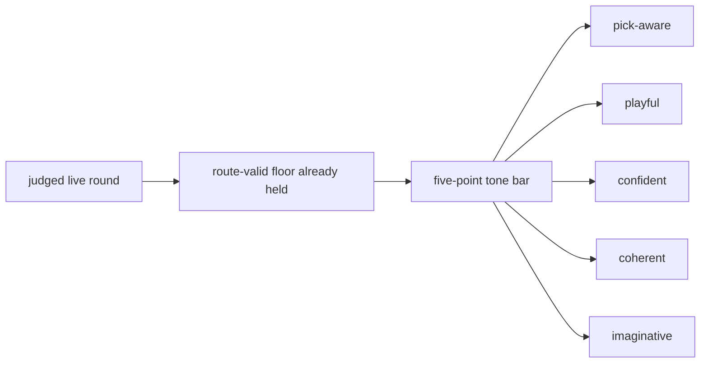

# Research Beta 3.0: Tone First

## What This Beta Asked

Can Scorey keep its own voice once route validity and pick legibility are no longer the open question?

## Short Answer

Started, separating real signal, but not settled.

The tone lane now has real separation, and the live route floor is still
holding on completed batches, but route-floor catch-up and tone review
throughput are both lagging the widened queue.

## Eval Shape

`Research Beta 3.0` keeps the live route-valid floor from the earlier betas, but changes the verdict question.

It judges each live round through five positive-only traits:

- `pick-aware`
- `playful`
- `confident`
- `coherent`
- `imaginative`

Its failure handling is now two-stage:

- `PASS / FAIL` at the tone gate
- if `FAIL`, then `RETAIN / EVICT`

What stays out of scope:

- scoreboard judgement as its own lane
- broader prose judgement as its own lane

## Diagram

## What It Showed

This beta has now started, and the first widened tone queue is not an all-pass surface.

Its starting surface was the already-judged live queue:

- `395` live rows
- `395` beab pass under the current narrow route-and-legibility lens
- `0` fail
- `0` pending

Since then, four more extended live runs have widened the active surface:

- `12` new live rows after output `18317`
- `257` new live rows after output `18329`
- `294` new live rows after output `18586`
- `294` new paper-only live rows after output `18880`
- all four runs stayed entirely inside the valid `Research Beta 1.0` route set

The current live snapshot is now:

- `1252` live rows recorded
- `958` beab pass at the route-and-legibility floor
- `0` beab fail
- `294` pending route review
- the newest paper-only batch stayed inside the expected paper route families:
  - `paper/paper`: `144`
  - `paper/rock`: `150`

The current tone lane now records:

- `104` rows judged
- `45` tone pass
- `59` tone fail
- `854` route-passed live rows still pending tone review
- the strongest pass pattern is object-specific slapstick or physical demotion that still tracks both picks
- the weak pattern is usually either generic `real one` / `napkin` or version/copy language, with a smaller playful line that is not coherent enough to keep

Inside the paper-only `294`-row run, the first isolation reads are already useful:

- `my paper was the real one and your paper was a napkin` is still a weak fail
- `my rock was stone-cold advantage and your paper was a napkin` is still a stronger pass
- the seam is not "napkin" by itself
- the seam is the thinner paper/paper framing around `real one`

So the open question is no longer whether Scorey stayed on-pick. It is whether Scorey sounds like Scorey once that floor is already satisfied.

## Why It Matters

Tone is the cleanest next widening step.

It is more specific than a broad prose pass, and it stays closer to the object's identity than a scoreboard-first lane would.

## What It Could Not Show

- scoreboard quality as its own judged lane
- broader prose quality as its own judged lane
- whether the five-point tone bar will stay stable across a larger judged queue
- whether later lenses will need a different sampling shape
- whether tone review can keep up once live generation widens again

## What Changed Next

The next useful move is to promote the completed paper-only batch through the
route floor, then keep tone review moving on that isolated paper lane until
the failure seam is sharp enough to support the next implementation pass.

That now includes a sharper failure rule:

- retain failures that still belong in the active lane as live evidence
- evict failures that prove the paper seam or another lane boundary needs an
  upstream correction before rerun
