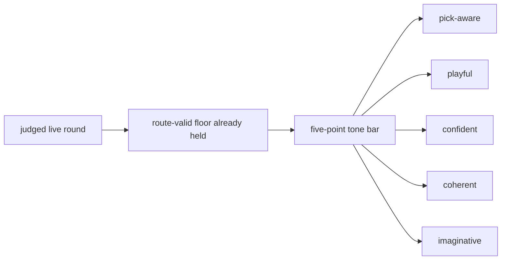

# Research Beta 3.0: Tone First

## What This Beta Asked

Can Scorey keep its own voice once route validity and pick legibility are no longer the open question?

## Short Answer

Pending.

The tone lane is now defined, but the judged tone pass has not started yet.

## Eval Shape

`Research Beta 3.0` keeps the live route-valid floor from the earlier betas, but changes the verdict question.

It judges each live round through five positive-only traits:

- `pick-aware`
- `playful`
- `confident`
- `coherent`
- `imaginative`

What stays out of scope:

- scoreboard judgement as its own lane
- broader prose judgement as its own lane

## Diagram

## What It Showed

This beta is now defined, but not yet evidenced.

Its starting surface is the already-judged live queue:

- `395` live rows
- `395` beab pass under the current narrow route-and-legibility lens
- `0` fail
- `0` pending

So the open question is no longer whether Scorey stayed on-pick. It is whether Scorey sounds like Scorey once that floor is already satisfied.

## Why It Matters

Tone is the cleanest next widening step.

It is more specific than a broad prose pass, and it stays closer to the object's identity than a scoreboard-first lane would.

## What It Could Not Show

- scoreboard quality as its own judged lane
- broader prose quality as its own judged lane
- whether later lenses will need a different sampling shape

## What Changed Next

The next useful move is to start the first judged tone pass on the live queue using the five-point bar.
