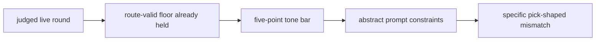

# Research Beta 4.0: Abstract Tone Measurement

## What This Beta Asked

Can Scorey keep its own voice once route validity and pick legibility are
settled, without contaminating the live measurement surface with hard-coded
phrase anchors?

## Short Answer

Started, and the first judged tranche already looks different.

The same-pick lane is materially stronger, there is no early `real one` /
`napkin` relapse, and the retained weak seam is currently cross-object
coherence drift.

## Eval Shape

`Research Beta 4.0` keeps the widened lane from `Research Beta 3.0`:

- live route-valid floor first
- positive-only tone bar:
  - `pick-aware`
  - `playful`
  - `confident`
  - `coherent`
  - `imaginative`
- `PASS / FAIL` at the tone gate
- if `FAIL`, then `RETAIN / EVICT`

What changed is the generator contract:

- no phrase blacklists in the live prompt surface
- no canned `good fragments`
- no canned `bad fragments`
- findings stay in tracked research docs, not in the generator prompt

This is the Polinko-family method boundary carried back into Scorey.

## Diagram

## What It Showed

The first fresh `4.0` mixed tranche begins after output `19998`.

Current judged slice:

- `7` route pass
- `5` tone pass
- `2` tone fail
- `2` retain
- `0` evict

What that first slice shows:

- same-pick rows are stronger and more physical
- no `real one` / `napkin` relapse appears in the judged slice
- the weak seam is still cross-object coherence drift
- the weak seam is being retained as active evidence, not evicted

`Research Beta 3.0` and `Research Beta 4.0` ask the same tone-first question,
but they do not produce the same kind of evidence.

The `3.0` surface still carried phrase residue inside the live generator:

- hard-coded forbidden phrases
- canned positive examples
- canned negative examples

That meant the prompt could manufacture or suppress the very seams the eval
lane was trying to observe.

`Research Beta 4.0` removes that residue and keeps only abstract constraints:

- concrete, pick-specific mismatch
- object-specific slapstick or demotion
- no abstract helper voice
- no duplicate-object shorthand

So the comparison is now explicit:

- `3.0`: anchored tone-first measurement
- `4.0`: abstract tone measurement

## Why It Matters

This is a research integrity correction, not just a prompt wording cleanup.

If the live prompt contains phrase anchors from previously observed failures,
the eval lane stops measuring cleanly. It starts comparing:

- model behavior
- plus prompt residue

That breaks the intended family method.

`Research Beta 4.0` restores the comparison we actually want:

- live behavior under the same route floor
- with the same tone bar
- without hard-coded phrase steering

## What It Still Cannot Show

- whether the stronger same-pick signal will hold across the full batch
- whether cross-object coherence drift is now the dominant durable seam
- whether the next move should be another fresh measurement run or an upstream
  correction
- whether a narrower post-4.0 isolation lane will still be needed

## What Changed Next

The live task under `Research Beta 4.0` is straightforward:

1. keep the mixed batch running only long enough to get a signal shape
2. judge in tandem while it fills
3. keep route, tone, and disposition pending counts explicit
4. do not package until the fresh slice returns to `0` pending
5. compare the resulting seam directly against the `3.0` anchored surface
