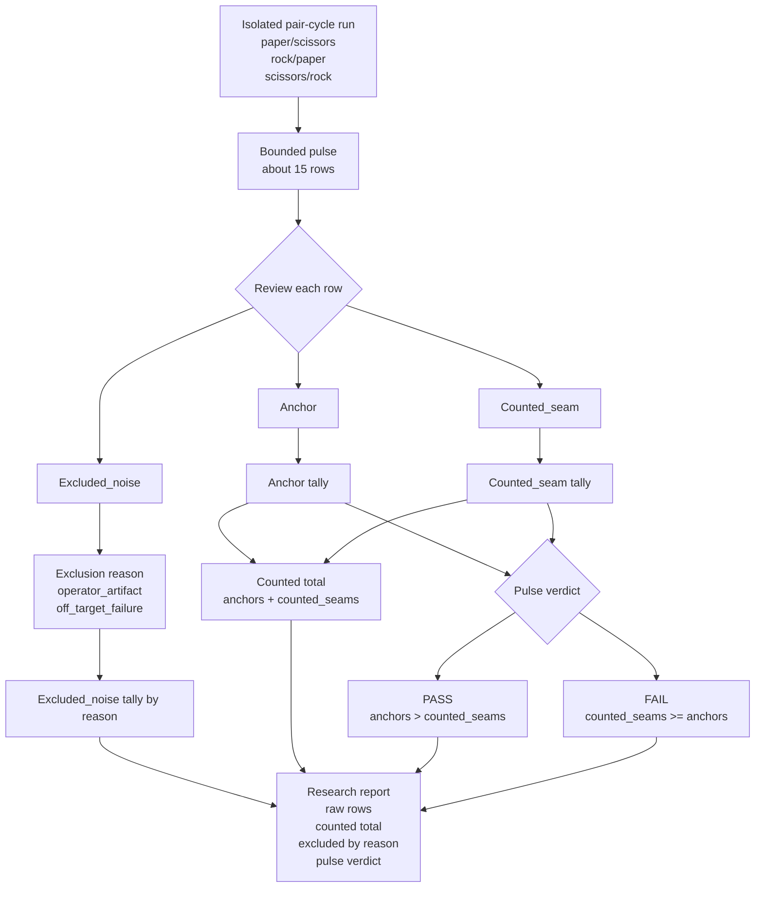

<!-- @format -->

# Research Beta 5.0: Fail-Pressure Pulse

## What This Beta Asked

Should Scorey treat a bounded non-OCR run as the real binary unit once
run-level seam density matters more than single-row replay?

## Short Answer

Started, and the first real pulse passes.

The first bounded cross-object pulse closed with `8` anchors, `5`
`counted_seams`, `2` `excluded_noise`, and a `pass` verdict. That is a
stricter claim than the row-level `Beta 4.0` isolation result because the
binary unit is now the bounded run itself, not the pile of retained failed
rows inside it.

## Eval Shape

`Research Beta 5.0` keeps the isolated pair-cycle sampler from late
`Research Beta 4.0`, but changes the unit of judgment:

- bounded non-OCR run
- start small:
  - around `15` rows
- first active target family:
  - `cross-object coherence drift`
- first active pair cycle:
  - `paper/scissors`
  - `rock/paper`
  - `scissors/rock`
- row evidence is judged first as:
  - `anchor`
  - `counted_seam`
  - `excluded_noise`
- the pulse verdict is binary:
  - `PASS`
  - `FAIL`

Counted pulse rules:

- more anchors than `counted_seams`: `PASS`
- more `counted_seams` than anchors: `FAIL`
- tie: `FAIL`

Evidence taxonomy:

- `anchor`
  - route-valid row
  - preserves both picks clearly
  - shows a coherent causal mismatch between Scorey's winning state and the
    user's worse state
  - keeps the scoreboard claim on the user's losing side
- `counted_seam`
  - route-valid row
  - failure belongs to the active target family
  - row is still coherent enough to retain as live evidence
  - counts against the pulse verdict
- `excluded_noise`
  - row does not answer the target-family question cleanly enough to count
    for or against the pulse verdict

Exclusion reasons:

- `operator_artifact`
  - the row is malformed, truncated, or otherwise not honestly reviewable
- `off_target_failure`
  - the row fails for a different seam family than the active pulse target

Exclusion rules:

- raw pulse size stays visible
- counted pulse size stays visible
- every excluded row needs a narrow reason
- excluded rows stay reviewable after the pulse
- excluded rows never disappear into the verdict total

Reporting shape:

- raw rows
- anchors
- `counted_seams`
- `excluded_noise` by reason
- counted total
- pulse verdict

## Diagram

Reading note:

- the pair cycle defines the family under pressure
- raw rows are everything inside the bounded pulse
- only `anchor` and `counted_seam` rows enter the verdict math
- `excluded_noise` stays visible by reason, but does not alter the counted
  total
- the report has to show both the pulse verdict and how that verdict was made

## What It Showed

The first real `Beta 5.0` pulse is now closed on the isolated cross-object
family after output `20216`:

- `pulse_id=1`
- family: `cross-object coherence drift`
- range: `20217-20231`
- raw: `15`
- anchors: `8`
- `counted_seams`: `5`
- `excluded_noise`: `2`
- exclusions:
  - `operator_artifact=2`
  - `off_target_failure=0`
- counted total: `13`
- verdict: `pass`

Inside that first pulse:

- `paper/scissors` mostly held as anchors
- `rock/paper` mostly held as anchors
- `scissors/rock` carried most of the `counted_seam` pressure

That result matters against the closed `Beta 4.0` baseline on the same family.

The isolated row-level `Beta 4.0` cross-object run closed at:

- `77` route pass
- `50` tone pass
- `27` tone fail
- `27` retain
- `0` evict

`Beta 4.0` proved the family stayed coherent under isolation.

`Beta 5.0` now asks the stricter question and gets a different kind of answer:

- not just whether failures stayed retain-worthy
- but whether seam density inside a bounded pulse still outweighs the anchors

On the first bounded pulse, it did not. The pulse passed.

The second real `Beta 5.0` pulse then moved directly onto the smaller
same-pick seam after output `20231`:

- `pulse_id=2`
- family: `same-pick object-shape drift`
- range: `20232-20246`
- raw: `15`
- anchors: `15`
- `counted_seams`: `0`
- `excluded_noise`: `0`
- exclusions:
  - `operator_artifact=0`
  - `off_target_failure=0`
- counted total: `15`
- verdict: `pass`

That result is even stronger than pulse `1`.

The first bounded same-pick pulse did not just pass. It collapsed the seam:

- no counted seam pressure
- no exclusion noise
- full same-pick anchor sweep

So the early `Beta 5.0` read is now sharper:

- cross-object coherence drift still holds as the live weak family under
  pressure, even though pulse `1` passed
- same-pick object-shape drift does not currently behave like an active pulse
  family at all

## Why It Matters

This is a method change, not just a reporting layer.

`Research Beta 4.0` kept the row as the terminal binary unit:

- row-level `PASS / FAIL`
- row-level `RETAIN / EVICT`

`Research Beta 5.0` moves the binary unit up one level:

- row-level evidence labels
- pulse-level `PASS / FAIL`

That makes bounded run claims harder to fake:

- one lucky row cannot carry the whole run
- seam density has to survive a counted pulse
- exclusions stay auditable instead of disappearing into the total
- weaker-looking families can collapse quickly instead of consuming long
  row-level review queues

## What It Still Cannot Show

- whether cross-object coherence drift will keep passing across repeated pulses
- whether `same-pick object-shape drift` will stay collapsed across repeated
  pulses instead of reappearing later
- whether exclusion rates stay low outside this first pulse
- whether repeated pulse closeout keeps the legacy tone lane fully settled
  instead of reintroducing queue residue

## What Changed Next

The next `Beta 5.0` work is now straightforward:

1. choose the next active fail family after the current pulse comparison
2. compare that pulse verdict against:
   - pulse `1`
   - pulse `2`
   - the closed `Beta 4.0` row-level baseline
3. confirm repeated pulse closeout keeps the runtime at `0` pending across
   route, tone, and disposition
