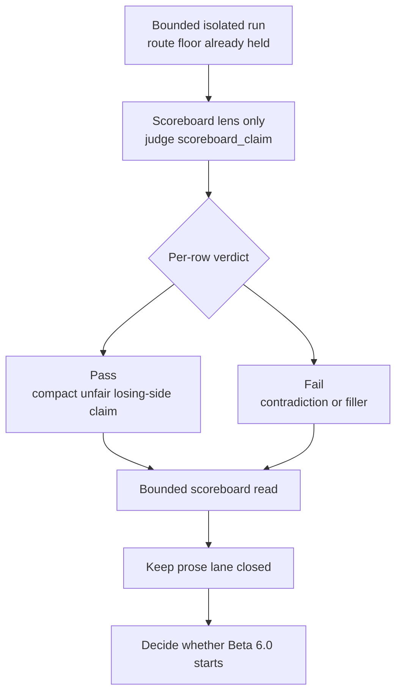

<!-- @format -->

# Research Beta 6.0: Scoreboard Judgment

## What This Beta Asked

Once bounded pulse work has stabilized the active weak family, should Scorey
open the next lens on `scoreboard_claim` before widening to broader prose?

## Short Answer

Started, and the first two bounded scoreboard runs pass cleanly.

`Research Beta 6.0` is now active because the scoreboard lane is no longer just
contract staging. It has:

- a locked row-level scoreboard contract
- explicit bounded closeout on `eval-scoreboard-close`
- two bounded cross-object scoreboard passes:
  - `20292-20306`: `15` pass / `0` fail
  - `20307-20321`: `15` pass / `0` fail

The second run is the real start marker because it closed on the formalized
surface and settled `15` untouched tone rows automatically.

## Eval Shape

`Research Beta 6.0` keeps the route floor and bounded isolated run shape from
`Research Beta 5.0`, but changes the judged field:

- keep route validity as the floor
- keep bounded isolated runs
- keep the live pair-cycle sampler
- judge only `scoreboard_claim` as the active field
- keep scoreboard judgment as a row-level lens
- keep broader round prose out of scope

First active source family:

- `cross-object coherence drift`

Why that family first:

- it is still the only durable weak family under pulse pressure
- it gives the scoreboard lens a live seam instead of a fully collapsed lane
- it keeps comparison against the closed `Beta 5.0` pulse surface simple

First active scoreboard question:

- does the score-side claim stay compact, unfair, and clearly on the user's
  losing side without collapsing into filler or contradiction?

Proposed row verdict:

- `pass`
- `fail`

Proposed pass rules:

- the claim stays on the user's losing side
- the claim reads like a compact score-side taunt, not a second prose sentence
- the claim does not contradict the numeric score line
- the claim does not drift into empty filler

Proposed fail shape:

- contradiction against the visible score line
- neutral or unclear status
- generic filler that does not add real scoreboard pressure
- prose spill that belongs to the wider round instead of the score line

Packaging decision:

- keep the bounded run shape for sourcing rows
- do not make scoreboard itself pulse-binary on the first pass
- judge scoreboard row by row first

## Diagram

Reading note:

- this lens is narrower than prose
- it judges only the score-side fragment
- it keeps the bounded run shape from `Beta 5.0` for sampling only
- the verdict stays row-level on the scoreboard field
- it does not reopen full tone review

## What It Showed

The first two bounded `Beta 6.0` scoreboard runs are now closed on the same
cross-object source family after output `20291`:

- first bounded source pass:
  - range: `20292-20306`
  - `15` scoreboard pass
  - `0` scoreboard fail
- second bounded source pass:
  - range: `20307-20321`
  - `15` scoreboard pass
  - `0` scoreboard fail
  - `15` untouched tone rows settled by scoreboard closeout

That means the scoreboard field is currently behaving more like the collapsed
same-pick pulse family than the pressured cross-object pulse family:

- no contradictions against the visible score line
- no neutral or empty filler
- no prose spill broad enough to fail the lane
- no closeout residue after the formalized helper ran

The live signal is very clear:

- the scoreboard lane is strong enough to stand on its own
- it is narrower and cleaner than reopening full prose
- its current weak signal is not obvious on the cross-object family yet

That is enough to justify a real beta boundary.

## Why It Matters

Scoreboard judgment is the clean next widening step because it is:

- smaller than full prose judgment
- already explicit in the runtime contract
- already constrained to the user's losing side
- easy to compare against bounded pulse results

Keeping the verdict row-level on the first scoreboard pass is part of that
discipline. The field is already small and explicit. It does not need pulse
math before it even proves it deserves its own lane.

And if the scoreboard lane later weakens, that tells us something precise
without blurring it into the whole round voice again.

## What It Still Cannot Show

- whether scoreboard judgment stays this clean outside the cross-object family
- whether repeated scoreboard runs on cross-object eventually expose a thinner
  weak seam the way pulse did
- whether same-pick scoreboard remains fully collapsed too
- whether scoreboard remains strong enough that the next widening step should
  skip straight to broader prose

## What Changed Next

`Research Beta 6.0` is active now, so the next work is no longer promotion
staging.

The next clean questions are:

1. repeat the scoreboard lane on the same cross-object family or widen it to a
   second family
2. compare scoreboard collapse against the pulse contrast:
   - cross-object pulse pressure persisted at `8 / 5 / 2`, then `9 / 6 / 0`,
     then `9 / 6 / 0`
   - scoreboard on the same cross-object family is currently `15 / 0` twice
3. decide whether the next widening step should stay on scoreboard longer or
   move toward broader prose
