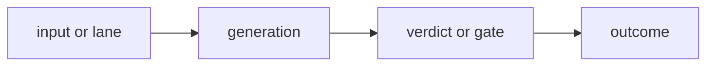

# Research Beta Template

Use this template for new tracked beta docs.

The house style is:

- concise
- visual-forward
- one clear research question per doc
- one Mermaid diagram per beta page
- shared section order across betas

## Title

`# Research Beta X.Y: Name`

## Section Order

Use this exact stack:

1. `## What This Beta Asked`
2. `## Short Answer`
3. `## Eval Shape`
4. Mermaid diagram
5. `## Current Signal`
6. `## Why It Matters`
7. `## What Changed Next`

## Working Skeleton

````md
# Research Beta X.Y: Name

## What This Beta Asked

One question only.

## Short Answer

State the answer directly.

## Eval Shape

- list the active lenses or gates
- keep this short



## Current Signal

- current counts, clusters, or lane-specific read
- only the evidence that matters for this beta

## Why It Matters

State the method or product meaning of the evidence.

## What Changed Next

State the next architecture shift or the next narrower question.
````

## Diagram Rule

- keep one Mermaid diagram in every beta doc
- let the diagram carry the eval shape
- keep prose around the diagram short and high-signal

## Scope Rule

- track method shifts
- track durable evidence reads
- keep operator residue in `docs/peanut/`
- keep sweep-by-sweep clutter out of tracked beta docs
