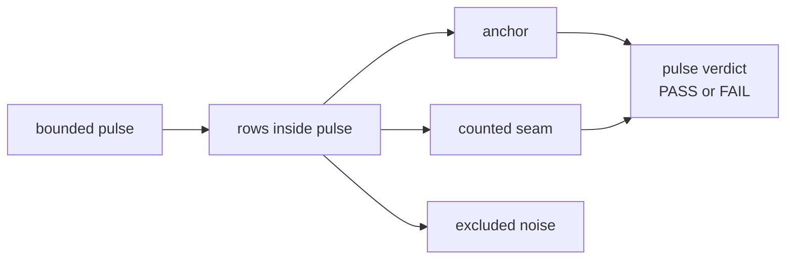

<!-- @format -->

# Pre-Beta 5.0: Fail-Pressure Pulse

## What This Pre-Beta Asks

Should Scorey treat a bounded non-OCR run as the real binary unit once
run-level seam density matters more than single-row replay?

## Status

Maybe, and the current cross-object isolation result is strong enough to make
the question worth staging explicitly.

`Research Beta 4.0` proved that row-level abstract measurement can narrow a
real seam without falling back into phrase anchors. This pre-beta note asks
whether the next method step should move the binary judgment up one level:

- the pulse becomes the binary unit
- the rows become evidence inside the pulse

## Eval Shape

This is not `Research Beta 5.0` yet.

It is the staging contract for a possible `5.0` promotion.

The proposed pulse shape for Scorey is:

- bounded non-OCR run
- start small:
  - around `15` rows
- row evidence is judged first as:
  - `anchor`
  - `counted seam`
  - `excluded noise`
- the pulse verdict is binary:
  - `PASS`
  - `FAIL`

Counted pulse rules:

- more anchors than counted seams: `PASS`
- more counted seams than anchors: `FAIL`
- tie: `FAIL`

Exclusion rules:

- raw pulse size stays visible
- counted pulse size stays visible
- every excluded row needs a narrow reason
- excluded rows stay reviewable after the pulse

## Diagram

## What This Would Change

If this graduates into `Research Beta 5.0`, Scorey would change the unit of
judgment for bounded non-OCR runs:

- `Beta 4.0`:
  - row-level `PASS / FAIL`
  - row-level `RETAIN / EVICT`
- `Beta 5.0` candidate:
  - row-level evidence labeling inside the pulse
  - pulse-level `PASS / FAIL`

That would make run-level shape harder to fake:

- one lucky row could not make the whole run look healthy
- seam density would matter more than isolated wins
- exclusion review would become part of pulse hygiene

## Why It Matters

The current `Beta 4.0` isolated cross-object run already showed a coherent
fail family:

- `77` route pass
- `50` tone pass
- `27` tone fail
- `27` retain
- `0` evict

That is exactly the kind of result that invites pulse judgment.

The row-level method already proved the seam is real. Pulse judgment would ask
a stricter question:

- does this family actually pass under bounded fail pressure
- or does counted seam density still outweigh the anchors

## What It Still Needs

Before this becomes `Research Beta 5.0`, Scorey still needs:

- a tight evidence taxonomy for:
  - `anchor`
  - `counted seam`
  - `excluded noise`
- a narrow exclusion reason set
- one first promoted pulse target
  - likely `cross-object coherence drift`
- explicit raw-count and counted-count reporting in the research surface

## What Would Promote It

This becomes `Research Beta 5.0` only when Scorey starts the first real pulse
run.

Promotion boundary:

1. pulse contract is accepted as the next eval unit
2. the first bounded pulse is launched
3. the research index flips from closed `4.0` to active `5.0`
4. pulse evidence, not just hypothesis text, becomes the current method
