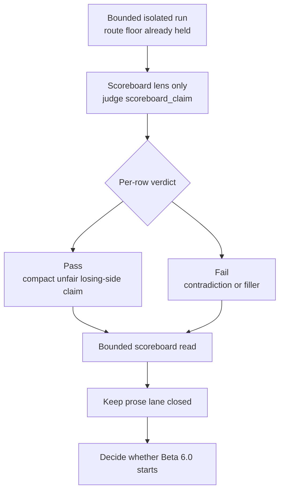

<!-- @format -->

# Research Pre-Beta 6.0: Scoreboard Judgment

## What This Pre-Beta Asks

Once bounded pulse work has stabilized the active weak family, should Scorey
open the next lens on `scoreboard_claim` before widening to broader prose?

## Status

Staged only.

`Research Beta 5.0` is still the active method. No `Beta 6.0` run has started
yet.

This note exists to pin the next lens cleanly before any scoreboard run
reclassifies the research surface.

The row-level scoreboard operator surface now exists, including explicit
bounded closeout:

- `eval-scoreboard-sample`
- `eval-scoreboard-judge`
- `eval-scoreboard-archive`
- `eval-scoreboard-close`

The first bounded scoreboard source pass has also happened already:

- range: `20292-20306`
- `15` scoreboard pass
- `0` scoreboard fail

That first source pass did not promote `Beta 6.0`.

It exposed the last staging seam instead:

- scoreboard review was real
- scoreboard closeout was not yet explicit
- untouched tone rows in-range had to be settled manually

That seam is now closed by the explicit scoreboard-close helper, so the next
promotion question can be asked on a clean operator surface.

## Eval Shape

`pre-Beta 6.0` keeps the route floor and bounded isolated run shape from
`Research Beta 5.0`, but changes the judged field:

- keep route validity as the floor
- keep bounded isolated runs
- keep the live pair-cycle sampler
- judge only `scoreboard_claim` as the active field
- start scoreboard judgment as a row-level lens
- keep broader round prose out of scope

First staged source family:

- `cross-object coherence drift`

Why that family first:

- it is still the only durable weak family under pulse pressure
- it gives the scoreboard lens a live seam instead of a fully collapsed lane
- it keeps comparison against the closed `Beta 5.0` pulse surface simple

First staged scoreboard question:

- does the score-side claim stay compact, unfair, and clearly on the user's
  losing side without collapsing into filler or contradiction?

Proposed row verdict:

- `pass`
- `fail`

Proposed pass rules:

- the claim stays on the user's losing side
- the claim reads like a compact score-side taunt, not a second prose sentence
- the claim does not contradict the numeric score line
- the claim does not drift into empty filler

Proposed fail shape:

- contradiction against the visible score line
- neutral or unclear status
- generic filler that does not add real scoreboard pressure
- prose spill that belongs to the wider round instead of the score line

Packaging decision:

- keep the bounded run shape for sourcing rows
- do not make scoreboard itself pulse-binary on the first pass
- judge scoreboard row by row first

## Diagram

Reading note:

- this lens is narrower than prose
- it judges only the score-side fragment
- it keeps the bounded run shape from `Beta 5.0` for sampling only
- the verdict stays row-level on the scoreboard field
- it does not reopen full tone review

## What This Would Change

If promoted, `Beta 6.0` would widen the research question in a smaller way
than prose judgment:

- `Beta 5.0` asks whether bounded seam pressure survives at the row-evidence
  level
- `Beta 6.0` would ask whether the score-side fragment is strong enough to
  earn its own judged lane

That keeps the next lens close to the current runtime boundary:

- `winning_state`
- `worse_state`
- `scoreboard_claim`

It widens only the last of those fields first.

It also resets the binary unit back down one level:

- `Beta 5.0`: pulse-level `PASS / FAIL`
- staged `Beta 6.0`: row-level scoreboard `PASS / FAIL`

## Why It Matters

Scoreboard judgment is the clean next widening step because it is:

- smaller than full prose judgment
- already explicit in the runtime contract
- already constrained to the user's losing side
- easy to compare against bounded pulse results

Keeping the verdict row-level on the first scoreboard pass is part of that
discipline. The field is already small and explicit. It does not need pulse
math before it even proves it deserves its own lane.

If the scoreboard lane is weak, that tells us something precise without
blurring it into the whole round voice again.

## What It Still Needs

- one fresh bounded scoreboard run on the explicit scoreboard-close surface
- a clean proof that scoreboard closeout returns the runtime to `0` pending
  across route, tone, and disposition
- a truth-synced scoreboard evidence surface strong enough to justify the
  promotion boundary

## What Would Promote It

This becomes active `Research Beta 6.0` only when:

1. the scoreboard lens contract is locked
2. bounded scoreboard closeout is explicit on the operator surface
3. a fresh bounded scoreboard run closes cleanly on that surface
4. the resulting evidence is truth-synced across the repo surface
