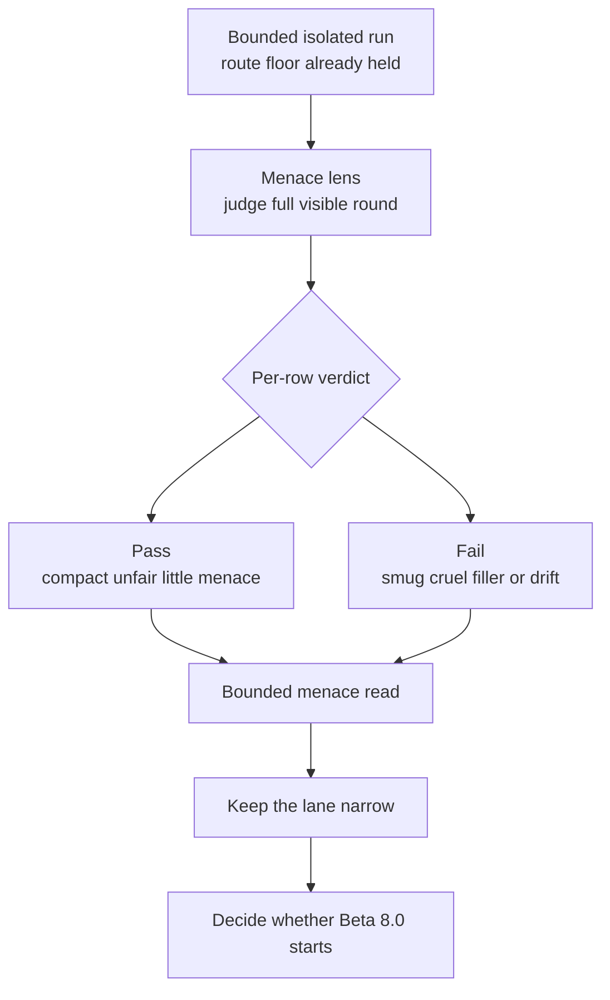

<!-- @format -->

# Pre-Beta 8.0: Menace Judgement

## What This Pre-Beta Asks

Once broader prose has stabilised as the next live weak surface, can Scorey
open a tighter judgement lane for the quality of its menace rather than only the
coherence of its prose?

## Status

Staged, not active.

`Research Beta 8.0` has not started yet. This note exists because the lower
gates are now stable enough to support a wider judgement question without
operator drift:

- pulse closeout is stable
- scoreboard closeout is stable
- prose closeout is stable
- `Beta 7.0` has already shown the active weak family clearly:
  - cross-object prose: `9 / 6`, then `9 / 6`
  - same-pick prose: `15 / 0`

So the next widening step no longer needs to ask only whether the round body is
coherent. It can ask whether Scorey is landing the right kind of tiny unfair
presence.

## Eval Shape

`pre-Beta 8.0` would keep the bounded isolated run shape from `Beta 7.0`, but
change the judged question again:

- keep route validity as the floor
- keep bounded isolated runs
- keep the live pair-cycle sampler
- keep the score line visible
- keep the broader round body visible
- judge the quality of the round's menace as a row-level lens on the full
  visible round

First staged source family:

- `cross-object coherence drift`

Why this family first:

- it is still the only durable weak family above the lower lanes
- it already reopens under broader prose while same-pick stays collapsed
- it is the sharpest place to test whether menace quality is the real next seam
  instead of another structural coherence problem

First staged menace question:

- does the visible round land as compact rigged-round menace without drifting
  into smugness, cruelty, or filler?

Proposed row verdict:

- `pass`
- `fail`

Proposed pass rules:

- the round feels unfair in a compact deliberate way
- the menace is playful, not mean
- the voice is confident without sounding smug or superior
- the pressure stays pick-specific and round-specific
- the round does not bloat into explanation, lecturing, or generic aggression

Proposed fail shape:

- smug or superiority-performing voice
- condescending or lecturey phrasing
- generic aggression or insult without rigged-round character
- prose too padded to feel like a tiny menace
- structural drift severe enough that menace quality cannot be judged honestly

Packaging decision:

- keep the bounded run shape for sourcing rows
- keep the verdict row-level on the first menace pass
- do not widen yet into a vague full-vibe lane

## Diagram

Reading note:

- this lane is wider than prose coherence
- it is still narrower than a loose whole-app personality judgement
- it judges the quality of the visible menace, not general likability
- it keeps the bounded source discipline that the newer gates already proved

## What This Would Change

If this lane starts, the repo would move from asking:

- does the broader round body still hold its rigged logic?

to asking:

- does the broader round body feel like the right kind of Scorey menace?

That is a different evidence question.

`Beta 7.0` already showed that the cross-object seam is structurally stable at
`9 / 6`. `pre-Beta 8.0` would treat that as the entry point for a narrower
voice-quality judgement above prose coherence.

## Why It Matters

This is the first staged lane that directly matches the object people are
actually responding to:

- not just prose validity
- not just scoreboard pressure
- but the tiny unfair charm of Scorey itself

If the repo can judge that cleanly, it will have a much sharper way to refine
Scorey's voice without accidentally training toward cruelty, smugness, or
generic hostility.

## What It Still Needs

- a locked row-level menace contract
- a decision entry that makes menace judgement the staged next lane after
  `Beta 7.0`
- the exact bounded source plan for the first run
- confirmation that the judged object is the full visible round, not just one
  fragment inside it

## What Would Promote It

`Research Beta 8.0` should start only when:

- the menace contract is locked
- the first bounded menace run closes cleanly
- the runtime returns to `0` pending after that run
- the resulting evidence shows something meaningfully different from the closed
  `Beta 7.0` prose surface
