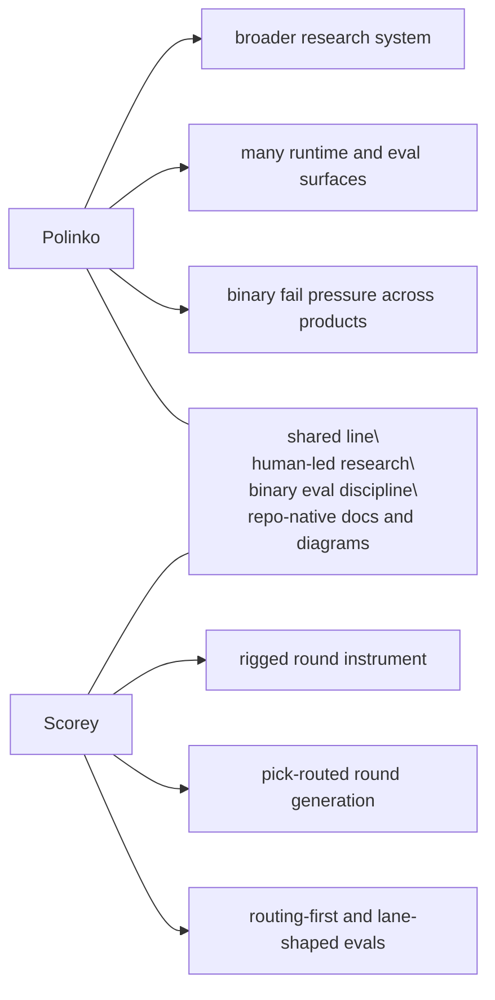

# Research

Scorey keeps the tracked research lane small on purpose.

Each beta is a distinct eval approach. This folder preserves the method shifts that changed what the evidence means.

Raw run notes and scratch material stay out of the tracked research surface until they become evidence.

## Current Beta

Current research lane:

- `Research Beta 7.0`
- `broader prose judgment`

Most recently closed beta:

- `Research Beta 6.0`
- `scoreboard judgment`

Current beta question:

What reopens once the judged surface widens above `scoreboard_claim` to the
broader round prose around the score line?

Current active family:

- `cross-object coherence drift`

Current active contrast:

- cross-object prose:
  - `20352-20366`: `9` pass / `6` fail
  - `20382-20396`: `9` pass / `6` fail
- same-pick prose:
  - `20367-20381`: `15` pass / `0` fail

Current finding:

- `Research Beta 4.0` stays closed as the row-level abstract measurement
  baseline
- `Research Beta 5.0` stays closed as the bounded pulse baseline:
  - cross-object pressure held at `8 / 5 / 2`, then `9 / 6 / 0`, then `9 / 6 / 0`
  - same-pick collapsed at `15 / 0 / 0`, then `15 / 0 / 0`
- `Research Beta 6.0` stays closed as the scoreboard baseline:
  - cross-object scoreboard: `15 / 0`, then `15 / 0`
  - same-pick scoreboard: `15 / 0`, then `15 / 0`
- `Research Beta 7.0` is the first wider prose lane above scoreboard:
  - cross-object prose reopened pressure at `9 / 6`
  - same-pick prose stayed collapsed at `15 / 0`
  - the cross-object prose split repeated at the same `9 / 6` shape
- runtime is currently closed at `0` pending across route, tone, and
  disposition

## Beta Map

| Beta | Question | What Changed |
| --- | --- | --- |
| `Research Beta 1.0` | Does Scorey choose a valid rigged route? | The first gate narrowed to pick routing only. |
| `Research Beta 2.0` | Can one object hold a stable win/loss lane? | Explicit local pair cycles isolate one object across both roles in one focused lane. |
| `Research Beta 3.0` | Can Scorey keep its own voice once routing is settled? | The live judged lane keeps the route floor but switches the verdict lens to tone first. |
| `Research Beta 4.0` | What changes when tone-first measurement drops phrase anchors? | The live judged lane keeps the same route floor and tone lens, but the generator contract shifts to abstract constraints aligned to the Polinko method. |
| `Research Beta 5.0` | What changes when bounded fail pressure becomes the binary unit? | The live isolated lane keeps the route floor, but rows become pulse evidence and the pulse becomes the `PASS / FAIL` unit. |
| `Research Beta 6.0` | Does the scoreboard fragment deserve its own judged lane? | The bounded isolated lane keeps the route floor, but the active verdict resets to row-level `PASS / FAIL` on `scoreboard_claim`. |
| `Research Beta 7.0` | What reopens once the judged surface widens above the scoreboard? | The bounded isolated lane keeps the route floor, but the active verdict widens from `scoreboard_claim` to the broader round prose around the score line. |

Current active beta note:

- `Research Beta 7.0`
- [Broader Prose Judgment](./BETA_7_BROADER_PROSE_JUDGMENT.md)
- opening broader prose evidence:
  - `20352-20366`: `9` pass / `6` fail
  - `20367-20381`: `15` pass / `0` fail
  - `20382-20396`: `9` pass / `6` fail

Most recently closed beta:

- `Research Beta 6.0`
- [Scoreboard Judgment](./BETA_6_SCOREBOARD_JUDGMENT.md)

Read in order:

1. [Research Beta 1.0: Pick Routing First](./BETA_1_PICK_ROUTING.md)
2. [Research Beta 2.0: Focused Object Lanes](./BETA_2_OBJECT_LANES.md)
3. [Research Beta 3.0: Tone First](./BETA_3_TONE_FIRST.md)
4. [Research Beta 4.0: Abstract Tone Measurement](./BETA_4_ABSTRACT_TONE_MEASUREMENT.md)
5. [Research Beta 5.0: Fail-Pressure Pulse](./BETA_5_FAIL_PRESSURE_PULSE.md)
6. [Research Beta 6.0: Scoreboard Judgment](./BETA_6_SCOREBOARD_JUDGMENT.md)
7. [Research Beta 7.0: Broader Prose Judgment](./BETA_7_BROADER_PROSE_JUDGMENT.md)

## How To Read The Betas And Stages

These betas and staged notes are research architectures. They are not app
release versions, package versions, branch names, or one more sweep.

Each beta marks a real change in what the evaluation is asking:

- `Research Beta 1.0` proved route validity at the pick level
- `Research Beta 2.0` keeps the same gate but changes the sampling shape to inspect one object lane at a time
- `Research Beta 3.0` keeps the live route floor but changes the verdict lens to Scorey's voice
- `Research Beta 4.0` keeps the tone-first question but changes the live generator contract from phrase-anchored to de-anchored measurement
- failed rows now stay binary first and then move through `RETAIN / EVICT` as
  the disposition layer
- `Research Beta 5.0` moves the binary unit from the row to the bounded pulse
  while keeping row evidence visible as:
  - `anchor`
  - `counted_seam`
  - `excluded_noise`
- `Research Beta 6.0` keeps the bounded source shape but narrows the verdict
  back down to row-level `PASS / FAIL` on `scoreboard_claim`
- `Research Beta 7.0` keeps the bounded source shape but widens the verdict
  above `scoreboard_claim` to the broader round prose around the score line

Later betas do not erase earlier ones. They narrow what each verdict is allowed to mean.

## Cross-Beta Flow

```mermaid
flowchart LR
  B1["Research Beta 1.0<br/>pick routing only"]
  B2["Research Beta 2.0<br/>focused object lanes"]
  B3["Research Beta 3.0<br/>tone first"]
  B4["Research Beta 4.0<br/>abstract tone measurement"]
  B5["Research Beta 5.0<br/>fail-pressure pulse"]
  B6["Research Beta 6.0<br/>scoreboard judgment"]
  B7["Research Beta 7.0<br/>broader prose judgment"]

  S1["six valid pass pairs<br/>and nothing else"]
  S2["one object isolated<br/>across win and loss roles"]
  S3["five positive tone traits<br/>on judged live rounds"]
  S4["same tone bar<br/>without phrase anchors<br/>in the live generator"]
  S5["bounded pulse verdicts<br/>with explicit row labels<br/>and exclusion reasons"]
  S6["scoreboard_claim holds<br/>as a row-level lane<br/>across tested families"]
  S7["broader prose reopens<br/>cross-object pressure<br/>at 9 pass / 6 fail"]

  B1 --> S1 --> B2 --> S2 --> B3 --> S3 --> B4 --> S4 --> B5 --> S5 --> B6 --> S6 --> B7 --> S7
```

## Plans

Plans are useful, but they are not evidence. They do not become active method until the repo earns them.

Parked lanes:

- object lanes:
  - complete for the current local pass
- live gameplay:
  - the widened live queue is now fully route-passed again
  - keep using those route-passed live rows as the tone-first evidence surface
  - after the stale queue archive, use fresh runs rather than old backlog traversal for the next tone evidence
- later eval lenses:
  - broader prose judgment is now the active widening step
  - no later widening lane is staged yet
- research visuals:
  - keep the beta map and per-beta notes in tracked docs
  - only add heavier cross-beta visuals if the method story actually needs them

## Polinko Contrast

Scorey uses the same **[Polinko research model](https://github.com/tryskian/polinko)**, but it is a smaller rigged-round instrument.

