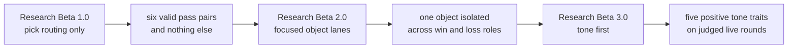
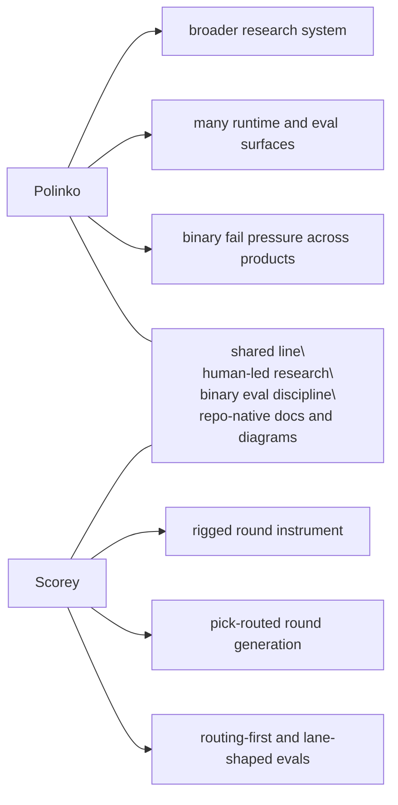

# Research

Scorey keeps the tracked research lane small on purpose.

Each beta is a distinct eval approach. This folder preserves the method shifts that changed what the evidence means.

Raw run notes and scratch material stay out of the tracked research surface until they become evidence.

## Current Beta

Current tracked research beta:

- `Research Beta 3.0`
- `tone first`

Current question:

Can Scorey hold its voice once route validity and pick legibility are no longer the open question?

Current finding:

- `Research Beta 1.0` proved the narrow routing contract
- `Research Beta 2.0` showed that each object lane can hold cleanly on the local deterministic path
- all three focused lanes completed with stable balance under the same routing gate:
  - rock:
    - `1790` rows of `rock/paper`
    - `1790` rows of `scissors/rock`
  - paper:
    - `1790` rows of `paper/scissors`
    - `1789` rows of `rock/paper`
  - scissors:
    - `1790` rows of `scissors/rock`
    - `1789` rows of `paper/scissors`
- the local deterministic queue is now fully judged:
  - `17,922` pass
  - `0` fail
  - `0` pending
- the live surface has now widened again:
  - `2076` live rows recorded
  - `1924` beab pass at the route-and-legibility floor
  - `0` beab fail
  - `152` pending route review
  - pair balances below stay in `scorey/user` order to match `Research Beta 1.0` pass pairs
  - seven recent completed live runs all stayed entirely inside the valid `Research Beta 1.0` route set:
    - after output `18317`: `12` new live rows
    - after output `18329`: `257` new live rows
    - after output `18586`: `294` new live rows
    - after output `18880`: `294` new paper-only live rows
    - after output `19174`: `170` new live rows
    - after output `19344`: `157` new live rows
    - after output `19501`: `342` new live rows
  - the next mixed run after output `19843` completed generation and reopened the active review slice:
    - `155` new live rows
  - the paper-only run stayed inside the expected paper route families:
    - `paper/paper`: `144`
    - `rock/paper`: `150`
  - the first mixed post-surface run also stayed inside the valid route families:
    - `paper/paper`: `34`
    - `paper/scissors`: `24`
    - `rock/paper`: `23`
    - `rock/rock`: `29`
    - `scissors/rock`: `28`
    - `scissors/scissors`: `32`
  - the next post-evict run also stayed inside the valid route families:
    - `paper/paper`: `25`
    - `paper/scissors`: `21`
    - `rock/paper`: `27`
    - `rock/rock`: `27`
    - `scissors/rock`: `26`
    - `scissors/scissors`: `31`
  - the newest mixed run is also sampling the expected route families so far:
    - `paper/paper`: `21`
    - `paper/scissors`: `27`
    - `rock/paper`: `31`
    - `rock/rock`: `25`
    - `scissors/rock`: `27`
    - `scissors/scissors`: `24`
  - `Research Beta 3.0` is now defined as a positive-only tone lens:
  - `pick-aware`
  - `playful`
  - `confident`
  - `coherent`
  - `imaginative`
  - the widened tone queue is now separating real signal:
    - `863` rows judged
    - `304` pass
    - `559` fail
    - `1061` archived out of the active tone queue
    - `0` route-passed live rows still pending tone review
    - the first fresh post-surface run is fully closed:
      - `170` route pass
      - `66` tone pass
      - `104` tone fail
      - `104` evict
      - `0` fresh pending route reviews
      - `0` fresh pending tone reviews
      - `0` fresh pending fail dispositions
    - the next post-evict run is also fully closed:
      - `157` route pass
      - `65` tone pass
      - `92` tone fail
      - `92` evict
      - `0` fresh pending route reviews
      - `0` fresh pending tone reviews
      - `0` fresh pending fail dispositions
    - the corrected two-hour tone batch after output `19501` is route-closed and wind-down-closed:
      - `342` route pass
      - `5` tone pass
      - `3` tone fail
      - `334` archived at wind-down before full tone review
      - `3` retain
      - `0` evict
      - `0` fresh pending route reviews
      - `0` fresh pending tone reviews
      - `0` fresh pending fail dispositions
    - the newest mixed run after output `19843` has completed generation but is not review-closed yet:
      - `3` route pass
      - `0` route fail
      - `152` fresh pending route reviews
      - `2` tone pass
      - `1` tone fail
      - `1` retain
      - `0` evict
      - `0` fresh pending tone reviews on already judged rows
      - `0` fresh pending fail dispositions on already judged rows
    - older pre-surface tone fails no longer sit in the active disposition queue:
      - `359` stale failed rows are now archived out of that surface
    - the current pass signal is object-specific slapstick or physical demotion that still tracks both picks
    - the current weak pattern has tightened from `real one` / `napkin` into mostly cross-object coherence drift with a smaller same-pick object-shape drift
    - the newest mixed run has not relapsed into `real one` / `napkin`; its first fail is smaller same-pick `rock/rock` object-shape drift around `cracked bottle cap`
  - inside the isolated paper-only tone lane:
    - `722` route-passed paper rows total
    - `566` judged
    - `185` pass
    - `381` fail
    - `156` archived after the failure seam was established
    - `0` pending

Current clean lane:

- the route floor was fully caught up through output `19843` before the newest run started
- the isolated paper-only run remains the clean seam-finding lane for the
  current `real one` / `napkin` pattern
- the latest corrected live run is wind-down-closed even though only the first
  judged tranche was tone-reviewed
- the next mixed live run after output `19843` has now completed generation and reopened a fresh active review slice
- that active slice currently has `152` route-pending rows, with only the first `3` route-pass rows judged for tone
- keep tandem judging on that fresh slice and do not package it until route, tone, and failure-disposition pending counts are all back to `0`
- treat tone failures through explicit disposition:
  - `retain` when the seam still belongs in the active lane
  - `evict` when the seam proves the lane definition itself is wrong
- stale historical failed rows can be archived out of the active disposition queue
- keep route and legibility as the floor even if the next lens widens
- keep the local deterministic queue as baseline evidence, not as the active growth surface
- widen into scoreboard or prose judgement only after the tone lane earns it

## Beta Map

| Beta | Question | What Changed |
| --- | --- | --- |
| `Research Beta 1.0` | Does Scorey choose a valid rigged route? | The first gate narrowed to pick routing only. |
| `Research Beta 2.0` | Can one object hold a stable win/loss lane? | Explicit local pair cycles isolate one object across both roles in one focused lane. |
| `Research Beta 3.0` | Can Scorey keep its own voice once routing is settled? | The live judged lane keeps the route floor but switches the verdict lens to tone first. |

Read in order:

1. [Research Beta 1.0: Pick Routing First](./BETA_1_PICK_ROUTING.md)
2. [Research Beta 2.0: Focused Object Lanes](./BETA_2_OBJECT_LANES.md)
3. [Research Beta 3.0: Tone First](./BETA_3_TONE_FIRST.md)

## How To Read The Betas

These betas are research architectures. They are not app release versions, package versions, branch names, or one more sweep.

Each beta marks a real change in what the evaluation is asking:

- `Research Beta 1.0` proved route validity at the pick level
- `Research Beta 2.0` keeps the same gate but changes the sampling shape to inspect one object lane at a time
- `Research Beta 3.0` keeps the live route floor but changes the verdict lens to Scorey's voice
- failed rows now stay binary first and then move through `RETAIN / EVICT` as
  the disposition layer

Later betas do not erase earlier ones. They narrow what each verdict is allowed to mean.

## Cross-Beta Flow

## Plans

Plans are useful, but they are not evidence. They do not become active method until the repo earns them.

Parked lanes:

- object lanes:
  - complete for the current local pass
- live gameplay:
  - the widened live queue is now fully route-passed again
  - keep using those route-passed live rows as the tone-first evidence surface
  - after the stale queue archive, use fresh runs rather than old backlog traversal for the next tone evidence
- later eval lenses:
  - only widen into scoreboard or prose judgement after the tone lane stabilises
- research visuals:
  - keep the beta map and per-beta notes in tracked docs
  - only add heavier cross-beta visuals if the method story actually needs them

## Polinko Contrast

Scorey uses the same **[Polinko research model](https://github.com/tryskian/polinko)**, but it is a smaller rigged-round instrument.

