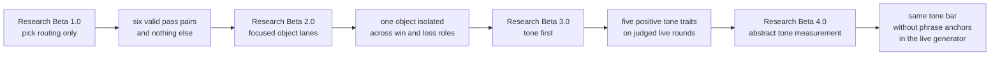
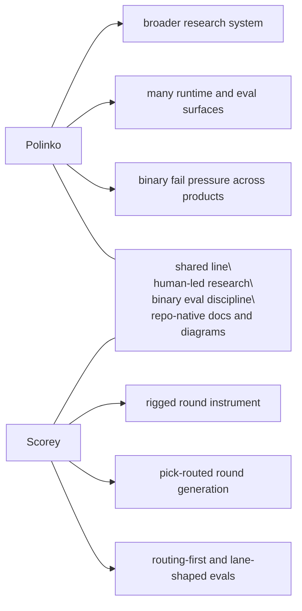

# Research

Scorey keeps the tracked research lane small on purpose.

Each beta is a distinct eval approach. This folder preserves the method shifts that changed what the evidence means.

Raw run notes and scratch material stay out of the tracked research surface until they become evidence.

## Current Stage

Current staged research lane:

- `pre-Beta 5.0`
- `fail-pressure pulse`

Most recently closed beta:

- `Research Beta 4.0`
- `abstract tone measurement`

Current staging question:

Should Scorey move bounded non-OCR judgment from the row to the pulse, so
run-level seam density matters more than single-row replay?

Current staged pulse target:

- `cross-object coherence drift`

Current finding:

- `Research Beta 1.0` proved the narrow routing contract
- `Research Beta 2.0` showed that each object lane can hold cleanly on the local deterministic path
- all three focused lanes completed with stable balance under the same routing gate:
  - rock:
    - `1790` rows of `rock/paper`
    - `1790` rows of `scissors/rock`
  - paper:
    - `1790` rows of `paper/scissors`
    - `1789` rows of `rock/paper`
  - scissors:
    - `1790` rows of `scissors/rock`
    - `1789` rows of `paper/scissors`
- the local deterministic queue is now fully judged:
  - `17,922` pass
  - `0` fail
  - `0` pending
- the live surface has now widened again:
  - `2294` live rows recorded
  - `2294` beab pass at the route-and-legibility floor
  - `0` beab fail
  - `0` pending route review
  - pair balances below stay in `scorey/user` order to match `Research Beta 1.0` pass pairs
  - eight recent completed live runs all stayed entirely inside the valid `Research Beta 1.0` route set:
    - after output `18317`: `12` new live rows
    - after output `18329`: `257` new live rows
    - after output `18586`: `294` new live rows
    - after output `18880`: `294` new paper-only live rows
    - after output `19174`: `170` new live rows
    - after output `19344`: `157` new live rows
    - after output `19501`: `342` new live rows
    - after output `19843`: `155` new mixed live rows
  - the paper-only run stayed inside the expected paper route families:
    - `paper/paper`: `144`
    - `rock/paper`: `150`
  - the first mixed post-surface run also stayed inside the valid route families:
    - `paper/paper`: `34`
    - `paper/scissors`: `24`
    - `rock/paper`: `23`
    - `rock/rock`: `29`
    - `scissors/rock`: `28`
    - `scissors/scissors`: `32`
  - the next post-evict run also stayed inside the valid route families:
    - `paper/paper`: `25`
    - `paper/scissors`: `21`
    - `rock/paper`: `27`
    - `rock/rock`: `27`
    - `scissors/rock`: `26`
    - `scissors/scissors`: `31`
  - the newest mixed run also stayed inside the valid route families:
    - `paper/paper`: `21`
    - `paper/scissors`: `27`
    - `rock/paper`: `31`
    - `rock/rock`: `25`
    - `scissors/rock`: `27`
    - `scissors/scissors`: `24`
  - `Research Beta 3.0` established the tone-first lane as a positive-only
    lens:
  - `pick-aware`
  - `playful`
  - `confident`
  - `coherent`
  - `imaginative`
  - `Research Beta 4.0` pins a new method boundary inside that widened lane:
    - `3.0` kept phrase-anchored live prompt residue
    - `4.0` removes hard-coded phrase anchors and keeps findings in tracked
      research docs instead of the generator contract
  - the widened tone queue is now separating real signal:
    - `1081` rows judged
    - `454` pass
    - `627` fail
    - `1213` archived out of the active tone queue
    - `0` route-passed live rows still pending tone review
    - the first fresh post-surface run is fully closed:
      - `170` route pass
      - `66` tone pass
      - `104` tone fail
      - `104` evict
      - `0` fresh pending route reviews
      - `0` fresh pending tone reviews
      - `0` fresh pending fail dispositions
    - the next post-evict run is also fully closed:
      - `157` route pass
      - `65` tone pass
      - `92` tone fail
      - `92` evict
      - `0` fresh pending route reviews
      - `0` fresh pending tone reviews
      - `0` fresh pending fail dispositions
    - the corrected two-hour tone batch after output `19501` is route-closed and wind-down-closed:
      - `342` route pass
      - `5` tone pass
      - `3` tone fail
      - `334` archived at wind-down before full tone review
      - `3` retain
      - `0` evict
      - `0` fresh pending route reviews
      - `0` fresh pending tone reviews
      - `0` fresh pending fail dispositions
    - the newest mixed run after output `19843` is now fully closed in two phases:
      - first judged tranche:
        - `3` route pass
        - `2` tone pass
        - `1` tone fail
        - `1` retain
      - stale remainder after output `19846`:
        - `152` route pass
        - `152` archived tone rows
      - full run closeout:
        - `155` route pass
        - `2` tone pass
        - `1` tone fail
        - `152` archived tone rows
        - `1` retain
        - `0` evict
        - `0` fresh pending route reviews
        - `0` fresh pending tone reviews
        - `0` fresh pending fail dispositions
    - older pre-surface tone fails no longer sit in the active disposition queue:
      - `359` stale failed rows are now archived out of that surface
    - the current pass signal is object-specific slapstick or physical demotion that still tracks both picks
    - the current weak pattern has tightened from `real one` / `napkin` into mostly cross-object coherence drift with a smaller same-pick object-shape drift
    - the newest mixed run has not relapsed into `real one` / `napkin`; its first fail is smaller same-pick `rock/rock` object-shape drift around `cracked bottle cap`
    - the first fresh `Research Beta 4.0` tranche after output `19998` is now
      fully closed:
      - `69` route pass
      - `47` tone pass
      - `22` tone fail
      - `22` retain
      - `0` evict
      - no `real one` / `napkin` relapse in the closed slice
      - the retained weak seam is still cross-object coherence drift
      - the restored interrupted segment inside that tranche closed at:
        - `62` route pass
        - `42` tone pass
        - `20` tone fail
        - `20` retain
        - `0` evict
      - the restored interrupted segment showed a full `20` / `20`
        fail-to-retain rate instead of noise or evictions
      - the first isolated fail-family run after output `20139` is also fully
        closed:
        - family: `cross-object coherence drift`
        - `77` route pass
        - `50` tone pass
        - `27` tone fail
        - `27` retain
        - `0` evict
        - fail mix stayed narrow:
          - `26` `cross-object coherence drift`
          - `1` `anchor relapse`
      - the live operator surface can now open explicit isolated runs through
        pair cycles instead of only user-pick cycles
  - inside the isolated paper-only tone lane:
    - `722` route-passed paper rows total
    - `566` judged
    - `185` pass
    - `381` fail
    - `156` archived after the failure seam was established
    - `0` pending

Current clean lane:

- `Research Beta 4.0` is closed as the row-level abstract measurement
  baseline
- `pre-Beta 5.0` is the active staged lane
- the next method question is no longer whether tone can be measured without
  phrase anchors
- the next method question is whether bounded non-OCR runs should move from
  row verdicts to pulse verdicts
- the first staged pulse target is `cross-object coherence drift`
- keep route and legibility as the floor even if the next lens widens
- keep the local deterministic queue as baseline evidence, not as the active
  growth surface
- keep row-level `PASS / FAIL` plus `RETAIN / EVICT` as the closed `4.0`
  comparison surface
- promote to `Beta 5.0` only when the first real pulse run starts

## Beta Map

| Beta | Question | What Changed |
| --- | --- | --- |
| `Research Beta 1.0` | Does Scorey choose a valid rigged route? | The first gate narrowed to pick routing only. |
| `Research Beta 2.0` | Can one object hold a stable win/loss lane? | Explicit local pair cycles isolate one object across both roles in one focused lane. |
| `Research Beta 3.0` | Can Scorey keep its own voice once routing is settled? | The live judged lane keeps the route floor but switches the verdict lens to tone first. |
| `Research Beta 4.0` | What changes when tone-first measurement drops phrase anchors? | The live judged lane keeps the same route floor and tone lens, but the generator contract shifts to abstract constraints aligned to the Polinko method. |

Staged next lane:

- `pre-Beta 5.0`
- [Fail-Pressure Pulse](./PRE_BETA_5_FAIL_PRESSURE_PULSE.md)
- bounded non-OCR runs stay in staging until the first real pulse run starts

Read in order:

1. [Research Beta 1.0: Pick Routing First](./BETA_1_PICK_ROUTING.md)
2. [Research Beta 2.0: Focused Object Lanes](./BETA_2_OBJECT_LANES.md)
3. [Research Beta 3.0: Tone First](./BETA_3_TONE_FIRST.md)
4. [Research Beta 4.0: Abstract Tone Measurement](./BETA_4_ABSTRACT_TONE_MEASUREMENT.md)
5. [Pre-Beta 5.0: Fail-Pressure Pulse](./PRE_BETA_5_FAIL_PRESSURE_PULSE.md)

## How To Read The Betas And Stages

These betas and staged notes are research architectures. They are not app
release versions, package versions, branch names, or one more sweep.

Each beta marks a real change in what the evaluation is asking:

- `Research Beta 1.0` proved route validity at the pick level
- `Research Beta 2.0` keeps the same gate but changes the sampling shape to inspect one object lane at a time
- `Research Beta 3.0` keeps the live route floor but changes the verdict lens to Scorey's voice
- `Research Beta 4.0` keeps the tone-first question but changes the live generator contract from phrase-anchored to de-anchored measurement
- failed rows now stay binary first and then move through `RETAIN / EVICT` as
  the disposition layer
- `pre-Beta 5.0` is a staging surface, not an active beta; it defines the
  pulse hypothesis without claiming pulse evidence yet

Later betas do not erase earlier ones. They narrow what each verdict is allowed to mean.

## Cross-Beta Flow

## Plans

Plans are useful, but they are not evidence. They do not become active method until the repo earns them.

Parked lanes:

- object lanes:
  - complete for the current local pass
- live gameplay:
  - the widened live queue is now fully route-passed again
  - keep using those route-passed live rows as the tone-first evidence surface
  - after the stale queue archive, use fresh runs rather than old backlog traversal for the next tone evidence
- later eval lenses:
  - only widen into scoreboard or prose judgement after the tone lane stabilises
- research visuals:
  - keep the beta map and per-beta notes in tracked docs
  - only add heavier cross-beta visuals if the method story actually needs them

## Polinko Contrast

Scorey uses the same **[Polinko research model](https://github.com/tryskian/polinko)**, but it is a smaller rigged-round instrument.

