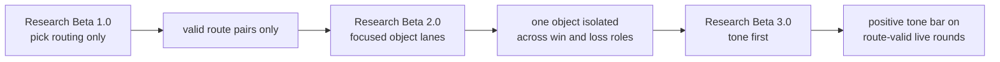
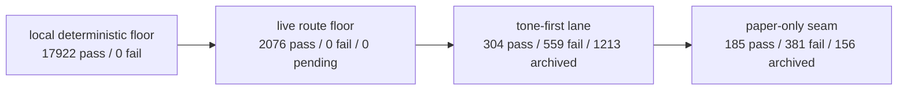
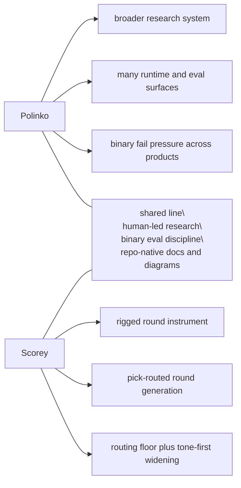

# Research

Scorey keeps the tracked research lane small on purpose.

Each beta is a distinct eval architecture. This folder preserves the method
shifts that changed what the evidence means.

Raw run notes, operator poking, and private scratch material stay in the local
`docs/peanut/` lane.

## Current Beta

Current tracked research beta:

- `Research Beta 3.0`
- `tone first`

Current question:

Can Scorey keep its own voice once route validity and pick legibility are no
longer the open question?

Current signal:

- deterministic local floor is fully closed:
  - `17,922 pass / 0 fail / 0 pending`
- live route floor is fully closed:
  - `2,076 pass / 0 fail / 0 pending`
- the active widened tone lane is now a real separation surface:
  - `304 pass / 559 fail / 1213 archived / 0 pending`
- the paper-only tone slice remains the clearest seam-finding lane:
  - `185 pass / 381 fail / 156 archived / 0 pending`
- the strongest pass pattern is object-specific slapstick or physical demotion
  that still tracks both picks
- the current weak seam is mostly cross-object coherence drift, with a smaller
  same-pick object-shape seam

## Beta Map

| Beta | Question | What Changed |
| --- | --- | --- |
| `Research Beta 1.0` | Does Scorey choose a valid rigged route? | The first gate narrowed to pick routing only. |
| `Research Beta 2.0` | Can one object hold a stable win/loss lane? | Explicit pair cycles isolated one object across both round roles. |
| `Research Beta 3.0` | Can Scorey keep its own voice once routing is settled? | The route-valid floor stayed fixed while the verdict lens widened to tone first. |

## Reading Order

1. [Research Beta 1.0: Pick Routing First](./BETA_1_PICK_ROUTING.md)
2. [Research Beta 2.0: Focused Object Lanes](./BETA_2_OBJECT_LANES.md)
3. [Research Beta 3.0: Tone First](./BETA_3_TONE_FIRST.md)
4. [Research Beta Template](./BETA_TEMPLATE.md)

## House Style

Tracked research docs stay concise and visual-forward.

Each beta doc should:

- use the shared section stack
- include one Mermaid diagram
- let the diagram carry the eval shape
- keep prose focused on the evidence read and its meaning

Use [Research Beta Template](./BETA_TEMPLATE.md) when adding a new tracked beta
page.

## Cross-Beta Flow

## Current Surface

## Parked Lanes

Plans are useful, but they are not evidence. They do not become active method
until the repo earns them.

- keep route validity and pick legibility as the floor
- use fresh live runs instead of stale backlog traversal for tone evidence
- widen into scoreboard or broader prose judgment only after the tone lane
  stabilises
- keep heavier visual surfaces out of tracked docs until the method story
  actually needs them

## Polinko Contrast

Scorey is part of the same line of work as Polinko, but it is a smaller
instrument.

