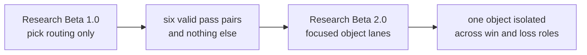
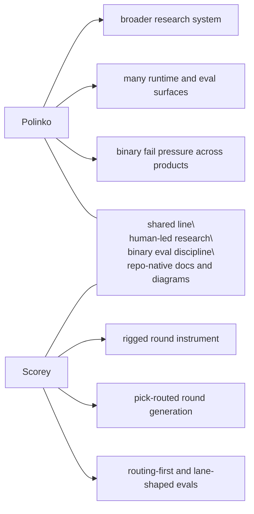

# Research

Scorey keeps the tracked research lane small on purpose.

Each beta is a distinct eval approach. This folder preserves the method shifts that changed what the evidence means.

Raw run notes, operator poking, and private scratch material stay in the local `docs/peanut/` lane.

## Current Beta

Current tracked research beta:

- `Research Beta 2.0`
- `focused object lanes`

Current question:

Can one object stay stable when Scorey is forced to show it as both a win and a loss?

Current finding:

- `Research Beta 1.0` proved the narrow routing contract
- `Research Beta 2.0` showed that each object lane can hold cleanly on the local deterministic path
- all three focused lanes completed with stable balance under the same routing gate:
  - rock:
    - `1790` rows of `rock/paper`
    - `1790` rows of `scissors/rock`
  - paper:
    - `1790` rows of `paper/scissors`
    - `1789` rows of `rock/paper`
  - scissors:
    - `1790` rows of `scissors/rock`
    - `1789` rows of `paper/scissors`
- the local deterministic queue is now fully judged:
  - `17,922` pass
  - `0` fail
  - `0` pending
- the first live batch is now in the database:
  - `12` rows
  - `12` routing pass
  - `0` routing fail
  - `12` human pending

Current clean probe:

- short judged live batches through the real API path
- judge the first live batch before widening the queue
- keep the local deterministic queue as baseline evidence, not as the active growth surface
- widen into prose, tone, or scoreboard judgement only after the live path stays on-pick

## Beta Map

| Beta | Question | What Changed |
| --- | --- | --- |
| `Research Beta 1.0` | Does Scorey choose a valid rigged route? | The first gate narrowed to pick routing only. |
| `Research Beta 2.0` | Can one object hold a stable win/loss lane? | Explicit local pair cycles isolate one object across both roles in one focused lane. |

Read in order:

1. [Research Beta 1.0: Pick Routing First](./BETA_1_PICK_ROUTING.md)
2. [Research Beta 2.0: Focused Object Lanes](./BETA_2_OBJECT_LANES.md)

## How To Read The Betas

These betas are research architectures. They are not app release versions, package versions, branch names, or one more sweep.

Each beta marks a real change in what the evaluation is asking:

- `Research Beta 1.0` proved route validity at the pick level
- `Research Beta 2.0` keeps the same gate but changes the sampling shape to inspect one object lane at a time

Later betas do not erase earlier ones. They narrow what each verdict is allowed to mean.

## Cross-Beta Flow

## Plans

Plans are useful, but they are not evidence. They do not become active method until the repo earns them.

Parked lanes:

- object lanes:
  - complete for the current local pass
- live gameplay:
  - the first live batch is now recorded
  - treat judged live rows as the next meaningful signal
- later eval lenses:
  - only widen into round prose, tone, or scoreboard judgement after the object lanes are stable
- research visuals:
  - keep the beta map and per-beta notes in tracked docs
  - only add heavier cross-beta visuals if the method story actually needs them

## Polinko Contrast

Scorey uses the same **[Polinko research model](https://github.com/tryskian/polinko)**, but it is a smaller instrument.

