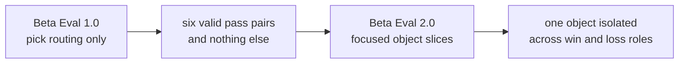

# Research

Scorey keeps the tracked research lane small on purpose.

Each beta is a distinct eval approach. This folder preserves the method shifts that changed what the evidence means.

Raw run notes, operator poking, and private scratch material stay in the local `docs/peanut/` lane.

## Current Beta

Current tracked eval beta:

- `Beta Eval 2.0`
- `focused object slices`

Current question:

Can one object stay stable when Scorey is forced to show it as both a win and a loss?

Current finding:

- `Beta Eval 1.0` proved the narrow routing contract
- the six-pair coverage run held the full `Beta 1.0` pass table cleanly
- the first focused rock slice stayed perfectly balanced:
  - `1790` rows of `rock/paper`
  - `1790` rows of `scissors/rock`
- the newest readback on that slice stayed all-pass under `Beta 1.0`

Current clean probe:

- one object at a time
- one winning role plus one losing role
- explicit local pair cycles in `scorey_pick,user_pick` order
- about one hour as the useful long-run checkpoint

## Beta Map

| Beta | Question | What Changed |
| --- | --- | --- |
| `Beta Eval 1.0` | Does Scorey choose a valid rigged route? | The first gate narrowed to pick routing only. |
| `Beta Eval 2.0` | Can one object hold a stable win/loss slice? | Explicit local pair cycles isolated one object across both roles. |

Read in order:

1. [Beta Eval 1.0: Pick Routing First](./BETA_1_PICK_ROUTING.md)
2. [Beta Eval 2.0: Focused Object Slices](./BETA_2_OBJECT_SLICES.md)

## How To Read The Betas

These betas are research architectures. They are not app release versions, package versions, branch names, or one more sweep.

Each beta marks a real change in what the evaluation is asking:

- `Beta Eval 1.0` proved route validity at the pick level
- `Beta Eval 2.0` keeps the same gate but changes the sampling shape to inspect one object slice at a time

Later betas do not erase earlier ones. They narrow what each verdict is allowed to mean.

## Cross-Beta Flow

## Plans

Plans are useful, but they are not evidence. They do not become active method until the repo earns them.

Parked lanes:

- object slices:
  - run the same focused slice shape for `paper`
  - run the same focused slice shape for `scissors`
- later eval lenses:
  - only widen into round prose, tone, or scoreboard judgement after the object slices are stable
- research visuals:
  - keep the beta map and per-beta notes in tracked docs
  - only add heavier cross-beta visuals if the method story actually needs them

## Polinko Contrast

Scorey is part of the same line of work as **[Polinko](https://github.com/tryskian/polinko)**, but it is a smaller instrument shaped more like **[Probaboracle](https://github.com/tryskian/probaboracle)**.

It keeps the same discipline:

- local CLI-first runtime
- narrow interaction surface
- agent-backed generation
- binary human judgement
- repo-native docs and diagrams

The toy object is different:

- Probaboracle studies answer-shaped non-answers.
- Scorey studies rigged round rulings.
